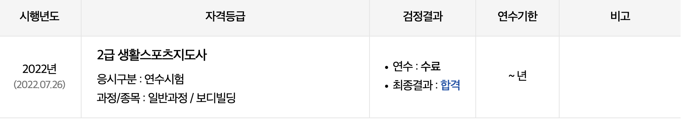
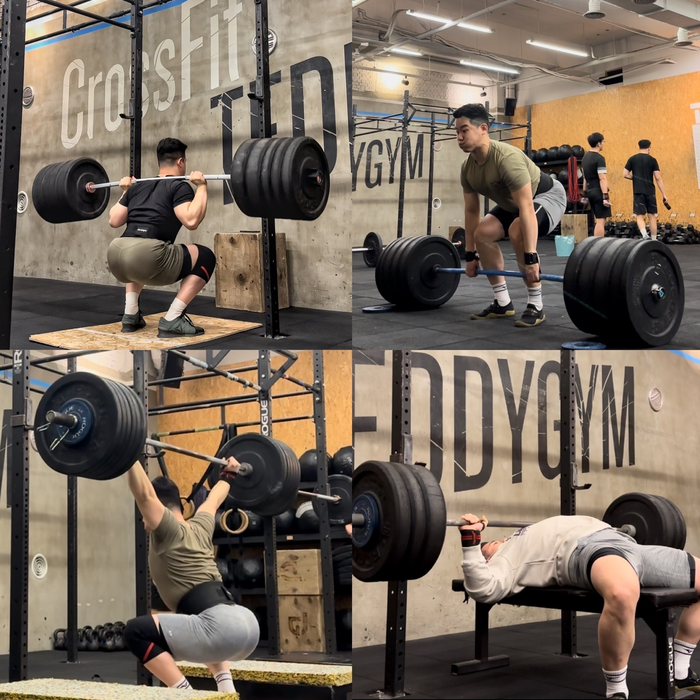

현재 네이버 파이낸셜 내자산&증권개발 팀에서 백엔드 개발을 하고 있습니다.  
긍정적인 마음과 강력한 체력을 바탕으로 왠만치 주는거 다 합니다.  
자세한 것은 프로필의 링크드인을 참조하시면 좋습니다.  

### 경력 

- 홍익대학교 컴퓨터공학과 학사 (2013~2019)  / 데이터베이스 연구실 학부연구생 (2018)
- 멋쟁이 사자처럼 5기 참여 및 6기 운영진 
- 스타트업 외주개발사 인썸니아 풀스택 개발 (2018)
- 네이버 - 네이버페이 CIC BE 인턴 (2019)
- **네이버 파이낸셜** 내자산 & 증권개발 BE (2020~)

### 사용 기술 

- Java / **Kotlin** / **SpringBoot**
- RDB, MongoDB(NoSql), Elaticsearch 
- Ruby on rails
- React 도 시키면 합니다 (NodeJS 1+1 가능)

### 운동 

- **생활스포츠지도사 2급** 보유 중입니다.
- 현재는 **크로스핏**을 하고 있습니다.
- 운동을 편식하지 않으며 맨몸 운동부터 스트렝스, 역도성 운동까지 꾸준히 훈련합니다.
- **하이바 스쿼트**와 **컨벤셔널 데드리프트**를 선호합니다.
- **훈련**과 **운동**을 구분 짓고 진행하는 편입니다.
- 크로스핏은 [테디짐](https://www.instagram.com/teddygym/?hl=ko), 이외 훈련은 [어반프라이빗짐](https://urbanprivategym.github.io/) 에서 진행합니다. 

