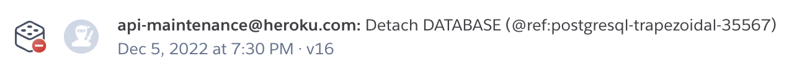

기존 ruby on rails 로 만들어져 heroku 에 배포되어 있는 donsdev.me 어플리케이션이  
postgres 유료화로 인해 DB 가 강제 detach 되면서 데이터가 모두 날아갔습니다...

조금만 일찍 메일을 봤었더라면..  
메일을 무시하지 않았더라면..

수많은 글들이 날아가지 않을 수 있었는데...  
그는 떠나갔습니다.

그래서 여기에서 다시 시작하려고 합니다.
남아있는 데이터를 모아 글도 채우고 새로운 글도 자주 자주 써 볼랍니다. 
 
그냥 블로그는 DB 없이 static 리소스로만 호스팅 하는게 맞지 않나 싶소  
그래서 리액트와 갯츠비를 이용해 블로그를 빌드 해 볼까 하오 

헤로쿠 xxx ..  
차라리 그때 AWS 쓸껄 ..