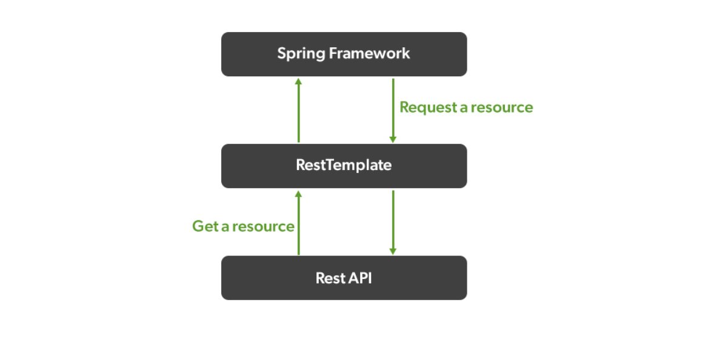

얼마 전 배치를 사용하여 주기적으로 사내 오브젝트 스토리지에 대용량 파일을 업로드 해야 하는 요구사항이 있었다. 이번 요구사항은 그냥 한 파일을 진득하게 동기 방식으로 업로드만 하면 되었기에 블로킹 I/O 기반의 RestTemplate 을 사용하기로 했다.

그냥 아래처럼 하면 쉽게 풀릴 요구사항이였다.

1. 쿼리를 잘 짜서 데이터를 청크 단위로 잘 읽고
2. 암호화 처리 등 잘 가공해서
3. csv 파일로 write 
4. REST API 방식으로 사내 오브젝트 storage 에 업로드 

개발 환경에서 테스트 해 보니 별 문제 없이 파일이 생성 되었고 업로드도 잘 되었다.
근데 이게 뭐람 실 환경에서 배치 Job이 힙 메모리 부족으로 실패를 하는 것..  
웃긴건 개발 환경에서 성공했던 때 대상 데이터 개수와 실 환경 데이터 개수가 차이가 거의 없었는데도 실 환경에서만 메모리가 터지는 것이다 (Out of Memory error)

그래서 곰곰히 고민했을때 

1. pod 메모리 설정 늘리기  
2. 업로드 전 파일 읽어들이는 방식 변경
3. RestTemplate 이 뭔가 이상하다.. 

1번을 고민하니 pod 메모리는 파일 용량에 비해 이미 충분했고 2번을 고민하니 업로드 할떄 파일은 InputStreamResource(청크 스트리밍 방식)로 효율적으로 잘 읽어 들이고 있어서 문제가 없어 보였다. 

바로 3번을 의심하고 RestTemplate 의 모든 Config 옵션을 까보기 시작했다.
그러다 발견한게 `setBufferRequestBody` 옵션.

`setBufferRequestBody` 옵션은 HTTP 요청 본문을 버퍼에 저장할지 여부를 설정하는 옵션이고, 요청 실패시 재 요청등에 사용하는 옵션인데, 공식 문서에 따르면 디폴트 값은 true이나 매우 큰 Response Body 가 들어오는 경우 false 로 세팅하기를 권장한다.

원문 :
> Indicate whether this request factory should buffer the request body internally. Default is true. When sending large amounts of data via POST or PUT, it is recommended to change this property to false, so as not to run out of memory.

이걸 보고 아래와 같이 설정을 하고 나니.. 

~~~kotlin
override fun get(): ClientHttpRequestFactory {
    return HttpComponentsClientHttpRequestFactory().apply {
        val httpClient: HttpClient = HttpClientBuilder.create()
            .evictIdleConnections(3L, TimeUnit.SECONDS)
            .evictExpiredConnections()
            .setMaxConnTotal(200)
            .setMaxConnPerRoute(200)
            .build()

        setConnectTimeout(3000)
        setReadTimeout(20000)
        setHttpClient(httpClient)
        setBufferRequestBody(false)
    }
}
~~~

문제 없이 파일이 업로드 되었다.
yoshi! 