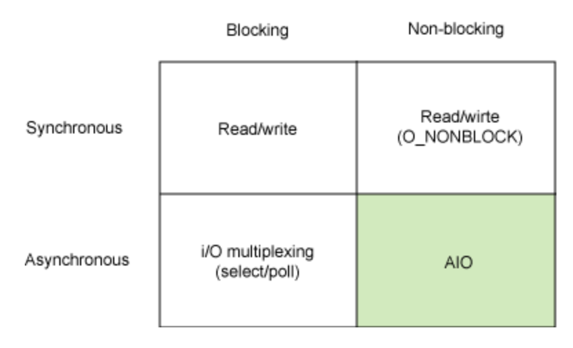
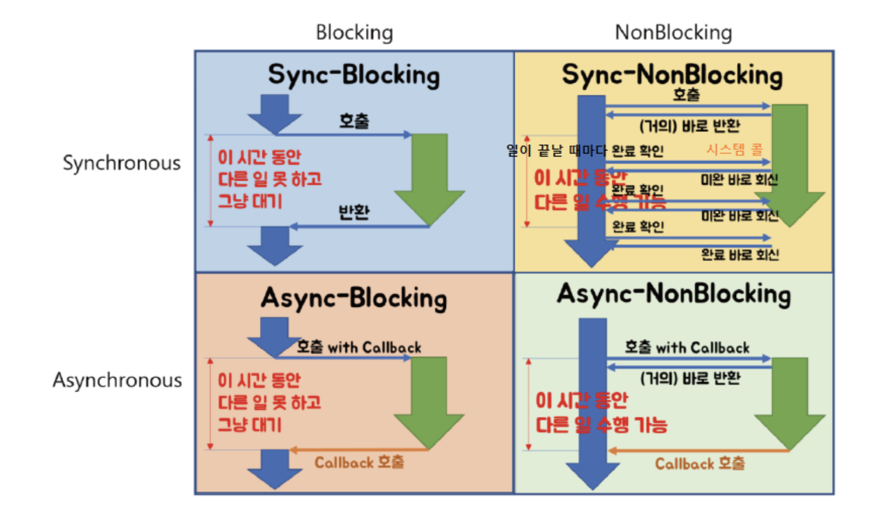

## Sync vs Async
수많은 글을 읽어 보고 제가 느낀 동기와 비동기의 차이는 **서브루틴의 결과값을 다루는 방식** 이며, **서브루틴의 순서가 보장되는지 여부** 입니다.  

### SYNC (동기)
**메인루틴** 에서 **A, B, C 작업 (서브루틴)** 을 순서대로 호출한다고 가정 했을 때, 동기 방식은 메인루틴이 서브루틴에게 결과를 질의하여 응답을 받는 방식입니다. 동기 방식에서 메인루틴은 각각의 서브루틴 (A, B, C) 의 결과를 순서대로 질의하며 코드 상에서 먼저 기입된 서브루틴의 값부터 차례대로 받아 봅니다. 

이렇게 되면 메인루틴의 흐름 내에서 서브루틴 작업의 순서가 `A -> B -> C` 로 보장 됩니다. 

### ASYNC (비동기)
**메인루틴** 에서 **A, B, C 작업 (서브루틴)** 을 순서대로 호출한다고 가정 했을 때, 비동기 방식은 서브루틴이 메인루틴에게 callback 을 통하여 자신의 작업 결과를 알리는 방식입니다. 이 때 메인루틴은 서브루틴의 결과값에 관심을 두지 않고 서브루틴이 때가 되면 알려 주겠지 하고 자기 할일을 합니다. 당연히 서브루틴 A, B, C는 수행 시간이 다를 것이고, 누가 먼저인지에 상관 없이 메인루틴 A 에게 결과를 callback 으로 알릴 것입니다.  

이렇게 되면 동기 방식과 달리 A 작업의 흐름 내에서 서브루틴 작업의 순서가 `A -> B -> C` 로 보장되지 않습니다.

## Blocking vs Non-Blocking
메인루틴에서 프로그램의 제어권이 서브루틴으로 넘어 왔을 때, 서브루틴이 작업이 완료되기 전이지만 제어권을 바로 메인 루틴에게 돌려주는지 혹은 작업이 끝날때까지 메인 루틴을 대기시키는지에 관한 내용입니다.

통상적으로 **Sync + Blocking** / **Async + Non-Blocking** 방식의 조합으로 프로그램을 구성하기 때문에 두 짝궁의 개념이 혼동되는 경우가 많습니다.

### Blocking 
말 그대로 서브루틴이 메인루틴의 흐름을 Block 합니다. 즉 프로그램의 **제어권**을 메인루틴에게 바로 돌려주지 않고 서브루틴의 작업이 끝날 때 까지 대기시킵니다. 이 시간동안 메인루틴은 아무 작업도 할 수 없습니다.

### Non-Blocking 
블로킹 방식과 달리, 작업이 완료가 되지 않았어도 프로그램의 **제어권**을 메인루틴에게 바로 돌려줍니다. 바로 돌려주기 때문에 메인루틴은 서브루틴이 종료되지 않아도 자신이 할 일을 진행할 수 있습니다.

## 이 방식들의 조합 

그림 출처 : [here](https://inpa.tistory.com/entry/%F0%9F%91%A9%E2%80%8D%F0%9F%92%BB-%EB%8F%99%EA%B8%B0%EB%B9%84%EB%8F%99%EA%B8%B0-%EB%B8%94%EB%A1%9C%ED%82%B9%EB%85%BC%EB%B8%94%EB%A1%9C%ED%82%B9-%EA%B0%9C%EB%85%90-%EC%A0%95%EB%A6%AC)

### SYNC + Blocking 
메인루틴이 서브루틴에게 처리 결과값을 질의하고, 제어권을 넘겨받은 서브루틴은 본인의 작업이 끝날 때 까지 제어권을 메인루틴에게 넘겨주지 않고 묵언 수행을 하다가 지 작업이 끝나서야 메인 루틴에게 결과값을 전달 합니다.  

서브 루틴의 순서가 보장됩니다.

### SYNC + Non-Blocking 
메인루틴이 서브루틴에게 처리 결과값을 질의하는 것은 1번 방식과 동일하지만, 2번 방식에서는 Non-Blocking 이기 때문에 서브루틴은 본인의 작업이 끝나지 않아도 메인 루틴에게 제어권을 바로 돌려줍니다. 

그러면 메인 루틴은 제어권을 받아 메인 루틴 내의 자기 할일을 하긴 하는데, Sync 방식이라 서브 루틴에게 계속 결과를 질의합니다.

> "다 했어?"

아직 작업을 마치지 못한 서브루틴 A 는 

> "아직 안 했어 ㅡㅡ 기다려"

라고 대답할 것이고, 

순서가 보장되는 Sync 방식 메인루틴은 A 작업이 끝날때 까지 다른 서브루틴인 B, C 작업을 진행할 수 없기 때문에 A 작업이 끝날때까지 끈질기게 질의합니다.

마침내 서브루틴 A가 

> "A 작업 끝났어 (오운완)"

하자마자 다른 서브루틴(B, C) 을 순차로 처리합니다.

### ASYNC + Blocking 
메인루틴은 서브루틴을 기다리지 않습니다. 다만 서브루틴이 종료될 때까지 프로그램의 제어권을 넘겨받지 못해 암것도 못합니다. 서브루틴 A가 콜백을 가져 갔으니 내가 신경쓸 필요 없다고 잘난척은 해 놨는데 막상 서브루틴이 제어권을 주지 않아서 결국엔 서브루틴 하나하나를 다 기다려야 하는 꼴입니다.

서브루틴의 순서가 의도치 않게 보장됩니다 ㅋㅋ 

### ASYNC + Non-Blocking 
메인루틴은 서브루틴을 기다리지 않습니다. 게다가 서브루틴이 종료되지 않아도 프로그램의 제어권을 바로 넘겨받아 후행 서브루틴을 바로 진행할 수 있습니다. 

서브루틴의 순서는 보장되지 않지만 효율적입니다.