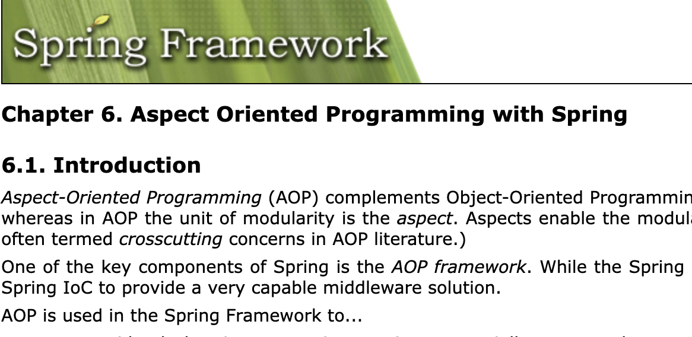

`AOP = Aspect Oriented Programming`

관점 지향 프로그래밍은 한 로직에서 핵심적인 관점으로 보는 로직과 그 외 부가적인 관점으로 보는 로직들을 나누겠다는 프로그래밍 패러다임이고 C++, 루비, 닷넷 프레임워크 등 많은 언어와 프레임워크에서 AOP 를 지원하고 있다.

사실 예전에 스프링 AOP 공부 할때 프록시 쪽은 제대로 보지 않았었고  
포인트컷.. 어드바이스.. 위빙.. 이런 용어가 있구나.. 프록시가 이거구나.. 정도로 넘어갔던거 같은데, 요즘 우리팀 인턴 분 과제 중 하나가 AOP 패러다임을 차용한 `resilience4j` 의 서킷 브레이커를 활용하는 것이라 이걸 좀 보다 보니 Spring Proxy 를 좀 자세히 알아 봐야겠다는 생각이 들었다.

`Proxy == 대리인`

프록시는 말 그대로 대리인 역할을 한다.

### Spring AOP 는 Proxy 기반으로 JDK Dynamic Proxy 와 CGLIB 를 활용하여 AOP를 제공하고 있다.

Spring Retry, resilience4j circuit breaker 은 모두 위 두가지 proxy 를 모두 사용할 수 있고, 둘은 작동하는 방식이 완전 다르다.

### 1. JDK Dynamic Proxy 
JDK Dynamic Proxy 는 Java 의 reflection 패키지에 존재하는 Proxy 클래스를 통해 생성된 프록시 객체이다.

`Proxy.newProxyInstance` 함수를 사용하여 동적으로 프록시를 만드는데 요 로직 내부에서 프록시 객체를 만들 때, 대리해야 할 객체의 구현 클래스로 객체를 생성하는게 아니라 인터페이스를 구현하여 만드는 형태이기 때문에 대리 대상이 되는 클래스는 무조건 인터페이스가 있어야 한다. 

만약 인터페이스가 아니라 구현 클래스를 인자로 전달한다면 오류가 발생한다.
아무튼 이를 이용하여 간단한 프록시 동작을 구현하는 코드 예제를 살펴 보자 

~~~kotlin
interface SomeInterface {
    fun doSth(): String
}

class SomeImpl : SomeInterface {  
    override fun doSth(): String {
        return "main activity"
    }
}

class SomeInvocationHandler(private val target: Any?) : InvocationHandler {
    override fun invoke(proxy: Any?, method: Method?, args: Array<Any?>?): Any? {
        println("Before Action")
        val result = method?.invoke(target, *args ?: arrayOf())
        println("After Action")
        return result
    }
}

fun main(args: Array) {
    val someInvocationHandler = SomeInvocationHandler(SomeImpl())

    val proxy = Proxy.newProxyInstance(
        SomeInterface::class.java.classLoader,
        arrayOf(SomeInterface::class.java),
        someInvocationHandler
    ) as SomeInterface

    println(proxy.doSth())
}
~~~

프록시가 구현한 `doSth` 함수에는 `someInvocationHandler` 의 invoke 함수에 기입된 내용들이 들어가 있을 것이고 실행하면 아래와 같은 결과가 출력될 것이다.

~~~
"Before Action"
"main activity"
"After Action"
~~~

JDK Dynamic 프록시에서 중요한 부분은 대리 대상 클래스가 무조건 인터페이스가 있어야 한다는 것이고, 해당 인터페이스를 구현하여 프록시 동작이 일어난다는 것이다.

### 2. CGLIB Proxy 

대리 대상 클래스가 인터페이스가 없다면, CGLIB Proxy 를 사용하는 방법도 있다.  
CGLIB Proxy 는 바이트 코드를 조작하여 동적으로 프록시를 생성하는데, 내부적으로 대리 대상 클래스를 상속받아 프록시를 생성하는 방식이므로 대상 클래스는 final 이면 안된다. (상속 가능해야 한다)

JDK Dynamic Proxy 에 `InvocationHandler` 가 있었다면 CGLIB 에는 MethodInterceptor 가 있고, JDK Dynamic Proxy 가 `newProxyInstance `로 프록시 객체를 만들었다면 CGLIB 는 `Enhancer` 라는 클래스의 객체가 프록시 객체를 생성한다. 

바로 예제 코드를 보자 

~~~kotlin
open class Some {  
    open fun doSth(): String {
        return "main activity"
    }
}

class SomeInterceptor(private val target: Any?) : MethodInterceptor {

    override fun intercept(obj: Any?, method: Method?, args: Array<out Any>?, proxy: MethodProxy?): Any? {
        println("Before Action")
        val result = method?.invoke(target, *args ?: arrayOf())
        println("After Action")
        return result
    }
}

fun main(args: Array) {
    val enhancer = Enhancer()
    enhancer.setSuperclass(Some::class.java)
    enhancer.setCallback(SomeInterceptor(target))
    val proxy = enhancer.create() as Some
    proxy.doSth()
}
~~~

CGLIB 프록시는 대리 대상 클래스를 상속받아 함수를 오버라이딩 하여 생성하는 방식이기 때문에 대리 대상 클래스에는 기본 생성자가 꼭 필요하고 상속이 가능해야 한다.  

자바는 final 키워드를 붙이기 전 까지는 상속이 가능하지만 코틀린은 기본적으로 final 클래스이기 때문에 아무런 변경자 없이 클래스를 선언하면 상속이 불가능하다. 따라서 코틀린에서 CGLIB 프록시를 사용하려면 대리 대상 클래스와 함수에 위 코드처럼 open 변경자를 잘 설정해야 한다. 

peace!