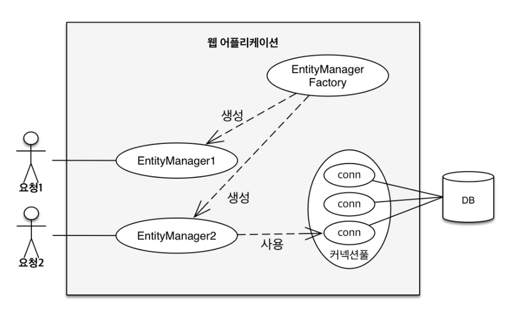

JPA 는 자바 ORM 의 표준이다.
`ORM = Object Relational Mapping`

말그래도 메모리에 떠다니는 Object 를 영속화 Layer 에 맞는 형태로 만들어 매핑하겠다는 패러다임이다. 그리고 영속성 컨텍스트란 말 그대로 Object가 영속화가 되는 순간과 그 전후를 나타내는 논리적인 맥락이라고 할 수 있을것 같다.

### EntityManager 

Spring 에서는 `EntityManager` 을 통해 이 영속성 컨텍스트에 접근할 수 있다. 다만 주의해야 할 것이 본래 JPA 의 `EntityManager` 은 Thread-Safe 하지 않다. 스레드간 `EntityManager` 을 공유한다면 영속성 컨텍스트의 상태가 개판이 될 것이다.

따라서 싱글톤 기반 스프링에서는 `EntityManager` 을 직접 주입받으면 안되고, Thread-Safe 한 `EntityManagerFactory` 로 `EntityManager` 을 생성해서 사용해야 한다.

~~~kotlin
val factory = Persistence.createEntityManagerFactory("factory")
val entityManager = factory.createEntityManager();
~~~

아니면 `@PersistenceContext` 어노테이션을 통해 주입 받는 방법도 있는데 이는 실제 `EntityManager` 을 주입 받는 것이 아니라 프록시 객체를 주입 받게 되며 내부적으로는 `EntityManagerFactory` 를 사용하여 `EntityManger` 를 생성하게 되어 Thread-Safe 를 보장하게 된다.

~~~kotlin
@PersistenceContext
private lateinit var nbbEntityManagerTwo: EntityManager
~~~

그리고 여기서 추가로 궁금해진 것이 `@Autowired` 로 주입 받으면 Proxy 가 아니라 진짜 `EntityManager` 객체를 주는가 에 대한 부분이였는데, 결론은 `@Autowired` 써도 프록시 객체를 주입 받는다. 

현재 우리 프로젝트는 `spring-boot-starter-data-jpa` 를 쓰고 있는데 얘가 스프링 빈 주입할때 @Autowired 라도 `EntityManager` 을 주입하는 상황이면 어노테이션과 상관없이 프록시 객체를 주는 것 같다.

이 부분을 추가로 확인하고 싶다면, 저 의존성을 떼내어 테스트 해 볼수 있겠지만 굳이 해보진 않았다. 그냥 아래 코드처럼 우리 프로젝트에서만 확인을 해 보았다.

~~~kotlin
@Autowired
private lateinit var entityManagerA: EntityManager

@PersistenceContext
private lateinit var entityManagerB: EntityManager

@Test
fun test() {
    println(entityManagerA)
    println(entityManagerB)
}
~~~

요렇게 주입받고 test 해 보면 둘다 프록시 객체인 것을 알 수 있다.

~~~
Shared EntityManager proxy for target factory [org.springframework.orm.jpa.LocalContainerEntityManagerFactoryBean@378bc0d4]
Shared EntityManager proxy for target factory [org.springframework.orm.jpa.LocalContainerEntityManagerFactoryBean@378bc0d4]
~~~

아무튼 엔티티매니저는 요청(스레드) 에 따라 Factory 에서 생성되어 영속화를 진행하게 된다. 

그림 출처 : https://catsbi.oopy.io/523e7c47-e9ab-43ef-bc19-3e527ecff3a7
