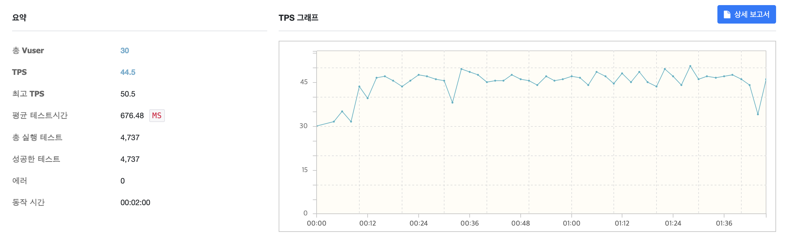

얼마 전 맡아 개발한 API 쪽에서 1000건 이상의 데이터 동시 요청 시,  
Slow Query 가 발생한 것도 아닌데 응답이 느려지고 한 pod 에서 CPU 가 spike 를 쳤던 현상이 있었습니다.

한 pod 에서만 해당 현상이 발생하였는데 빠르게 발견하고 대응하여 장애로 이어지지는 않았지만, 원인을 파악하는데 애 좀 먹었습니다.

## 1. 상황 설명 

### (1) 목록 조회성 API 전체 지연 발생 
- 데이터 목록 내려주는 API 
- 목록을 집계해서 내려주는 API

### (2) Pod 1개가 CPU 100% 도달

- 17시 19분 경 한개 pod 이 CPU 쓰로틀링이 걸리며 성능 저하 발생 
- 한 pod 이 사용량이 높아졌지만 pods 간 평균 사용량이 오토 스케일링 생성 기준 임계치(1.5코어) 에 닿지 않아 수평 오토스케일링이 이뤄지지 않음
- 문제 pod 인위적으로 삭제하고 replica pods 을 늘리고 나서야 지연 해소 

## 2. 장애 원인 분석 

### Q. 어떤 상황에서 CPU spike 와 성능 저하가 발생하거나 재현 되는가?
쿼리하는 결과의 개수가 1000 개 이상인 요청이 여러 건 동시에 발생할때 CPU 사용량이 급격히 증가했으며, 결과 개수가 많으면 비교적 적은 처리량인 10~30TPS 수준에서도 CPU spike 가 발생 하였습니다. 일반적으로 처리하는 데이터 개수인 200-300 개 수준에서는 100TPS 이상 처리해도 CPU spike 가 발생하거나 응답 지연이 발생하지 않았습니다. 

### (1) MongoDB 쪽에서 Slow Query 가 발생했는가? 
API 의 거의 모든 쿼리는 인덱스 기반 조회가 이루어지며 실제 쿼리 기록을 확인해 봐도 대부분 5ms 이내에 이루어졌고, 장애시점 DBA 및 모니터링 툴에서도 DB쪽에는 특별한 부하나 슬로우 쿼리가 없음을 명확히 확인했습니다. 

### (2) 비즈니스 로직이 비효율적인가?
~~~kotlin 
val stmtByDate = stmtMongoRepository
    .findBySth(sth)
    .asSequence()
    .filter { it.isXX() }
    .filterNot { it.isXX2() }
    .groupBy { it.date }
~~~
위에서 보는 것과 같이 비즈니스 로직은 MongoDB 에서 쿼리 결과를 받아온 뒤 단순 필터링 하고 Group By 하여 Map 을 생성하는 가벼운 로직입니다. 확실한 검증을 위하여 DB Read 하는 부분만 없애고 임시 객체 목록 여러개를 랜덤 생성하여 처리하도록 하는 테스트용 API를 추가하여 부하를 걸어 보았으나 1000TPS 가 넘게 처리가 가능했고 CPU spike 문제도 없었으며 응답도 빨랐습니다.
 
### (3) Connection Pool 이 오픈되는데에 CPU 비용이 큰가?

로직 외에도 Connection Pool 이 생성될때 발생하는 CPU 부하인지도 의심해 보았는데요

MongoDB 연결 시 커넥션풀의 최소 개수와 최대 개수 설정이 가능한데 `minPoolSize` 와 `maxPoolSize` 를 충분한 개수로 통일하여 어플리케이션 시작 이후에 커넥션 풀 생성이 이루어지지 않도록 설정하고 부하를 걸었을때도 설정 이전과 동일한 TPS 수준에서 CPU 100% 를 달성하는것을 확인할 수 있었습니다.

### (4) DB 커서의 batchSize 문제인가?
혹시 커서가 한꺼번에 가져오는 데이터가 적어 여러번 요청을 하여 문제가 발생 했는지 의심하여 커서의 배치 사이즈를 늘려서 부하 테스트를 해 보았으나 이 경우에도 커서 배치 크기와 상관없이 CPU Spike 가 발생 하였습니다. 

### (5) spring-data-mongodb 라이브러리의 기본 역직렬화 컨버터의 성능 문제인가?
spring-data-mongodb 의 내부 로직을 살펴보면 `MappingMongoConverter` 를 이용하여 MongoDB Document를 POJO 에 매핑합니다.  
이 과정에서 개발자가 Custom Converter 을 따로 구현해 두지 않았다면 기본 컨버터 구현체는 리플렉션을 사용하여 역직렬화를 진행합니다.  

런타임에 동적으로 타입을 분석하는 리플렉션 방식의 특성에 따라, 많은 데이터 목록의 역직렬화 시 성능 문제가 발생할 수 있다는 생각을 하였고 Thread Dump 와 프로파일러를 통해서 리플렉션을 이용한 역직렬화 부분에서 실제로 CPU 시간을 주로 점유하고 있음을 확인하였습니다. 

실제로 부하 상황시 가장 많은 스레드를 점유하고 있던 코드는 아래와 같이 리플렉션을 사용하여 프로퍼티를 매핑하는 부분이였습니다. 

~~~
stackTrace:
java.lang.Thread.State: RUNNABLE
at app//kotlin.jvm.JvmClassMappingKt.getJavaObjectType(JvmClassMapping.kt:58)
at app//kotlin.reflect.jvm.internal.KClassImpl.equals(KClassImpl.kt:293)
at app//kotlin.jvm.internal.Intrinsics.areEqual(Intrinsics.java:167)
at app//kotlin.reflect.jvm.internal.KFunctionImpl.equals(KFunctionImpl.kt:176)
at app//kotlin.jvm.internal.Intrinsics.areEqual(Intrinsics.java:167)
at app//kotlin.reflect.jvm.internal.KParameterImpl.equals(KParameterImpl.kt:67)
... 
app//org.springframework.data.mapping.model.ClassGeneratingEntityInstantiator.createInstance(ClassGeneratingEntityInstantiator.java:102)
at app//org.springframework.data.mongodb.core.convert.MappingMongoConverter.read(MappingMongoConverter.java:523)
at app//org.springframework.data.mongodb.core.convert.MappingMongoConverter.readDocument(MappingMongoConverter.java:491)
at app//org.springframework.data.mongodb.core.convert.MappingMongoConverter.read(MappingMongoConverter.java:427)
... 
at com.sun.proxy.$Proxy256.findBySth(Unknown Source)
at com.xx.yy.zz.api.aggs.AggregationService.aggregate(AggregationService.kt:20)
~~~

## 3. 확실히 리플렉션 방식 역직렬화의 성능 문제가 맞는가?

리플렉션은 비즈니스 로직의 유연성을 높이는 대신 컴파일 타임이 아닌 런타임에 동적으로 타입을 분석하여 클래스의 정보를 가져오게 되므로, JVM 최적화를 수행할 수 없다는 점에서 성능 문제가 발생할 수 있으나 어느정도 성능 문제가 발생할 수 있는지에 대한 정량적 정보는 없으므로 프로젝트 요구사항과 데이터 처리량에 따라 성능을 확인해야 했습니다. 

꽤 많은 참고 자료에서는 JIT compiler 의 바이트 코드 캐싱 등의 도움을 받아 거의 성능 차이가 없다는 식의 글들도 많이 있었고, 무엇보다 흔히 쓰이는 json 역직렬화 라이브러리 jackson 또한 기본적으로 리플렉션 방식을 사용하고 있어 성능은 전혀 걱정하지 않고 있었습니다. 

그러나 리플렉션 방식을 이용한 역직렬화 부분에서 많은 CPU 시간을 사용하고 있다는 것을 스레드 덤프와 프로파일링을 통해 확인하였기 때문에 nGrinder 을 이용하여 많은 요청량이 몰리는 상황에서 실제로 리플렉션 성능 저하가 발생하는지 확인해 보았습니다.

### 공통 상황 
- vuser 30명 
- 한 요청당 역직렬화 대상 데이터는 1000~1500개
- DB관련 설정 (Connection Pool 개수, 배치 사이즈 등) 은 모두 동일 
- 필터링, map 생성 등 역직렬화 외 모든 비즈니스 로직은 동일 

### 테스트 결과 
1. spring-data-mongodb + 기본 컨버터 (리플렉션 사용) 
~~~kotlin
val readData = mongoRepository.findSthByXX()
~~~

1. spring-data-mongodb + 커스텀 컨버터 (리플렉션 미사용) 
~~~kotlin
val readData = mongoRepository.findSthByXX()
~~~

~~~kotlin
class DocumentToPojoConverter : Converter<Document, Pojo> {
    override fun convert(source: Document): Pojo {
        return Pojo(
            id = source.getString("_id"),
            field1 = source.getString("field1"),
            ...
        )
    }
}
~~~

~~~kotlin
@Configuration
class MongodbConfig(
    @Value("\${mongodb.uri}") private val mongodbUri: String,
    @Value("\${mongodb.auto-index-creation:false}") private val autoIndexCreation: Boolean,
) : AbstractMongoClientConfiguration() {
    ...

    override fun configureConverters(converterConfigurationAdapter: MongoCustomConversions.MongoConverterConfigurationAdapter) {
        converterConfigurationAdapter.registerConverters(
            listOf(
                DocumentToPojoConverter(),
            )
        )
    }
}
~~~

1. mongoTemplate + Jackson (리플렉션 사용)
~~~kotlin
val readData = collection.find(query).map { objectMapper.readValue(it.toJson(), Pojo::class.java)}
~~~

1. mongoTemplate + 직접 매핑 (리플렉션 미사용)
~~~kotlin
val readData = collection.find(query).map { it.toPojo() }
~~~

~~~kotlin
fun Document.toPojo(): Pojo {
    return Pojo(
        id = getString("_id"),
        field1 = getString("field1"),
        ....
    )
}
~~~

### 테스트 결과 요약 

|순위|테스트 케이스|평균 TPS|
|------|---|---|
|1|mongoTemplate + 직접 매핑 (리플렉션 미사용)|187|
|2|spring-data-mongodb + 커스텀 컨버터 (리플렉션 미사용)|103|
|3|mongoTemplate + Jackson (리플렉션 사용)|44|
|4|spring-data-mongodb + 기본 컨버터 (리플렉션 사용)|18|

- 리플렉션을 사용하지 않은 케이스가 성능이 더 우수 
- spring-data-mongodb 의 오버헤드가 없는 mongoTemplate 직접 사용이 성능이 더 우수 
- 필드(프로퍼티) 수가 많을수록 리플렉션을 사용할 시 성능 저하가 더 심함 

## 3. 결론
저는 위의 케이스에서 그나마 코드 변경이 적고 성능도 어느정도 나오는 **2번 방법 (spring-data-mongodb + 커스텀 컨버터)** 을 이용하여 다량 조회 성능을 개선하기로 결정 하였는데요 

리플렉션은 어노테이션 처리, Jackson 과 같은 각종 라이브러리에서 널리 쓰이는 API 로 런타임에 타입에 따라 유연하게 클래스 정보를 다룰 수 있고 JIT Compiler 의 캐싱 등으로 상황에 따라서는 성능과 유연성 두마리 토끼를 잡을 수 있는 유용한 방식이기도 하지만 성능이 중요한 상황에서는 리플렉션의 사용을 진지하게 검토해 보고 고민해 보아야 할 것 같습니다.