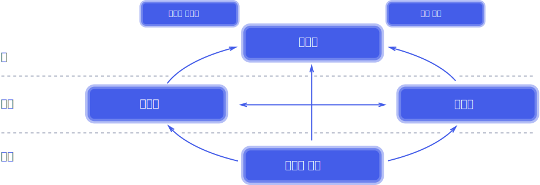

## 1. 리액티브 시스템과 리액티브 프로그래밍
### 1.1 리액티브 시스템이란
리액티브 시스템은 단어 그대로 **반응을 잘 하는 시스템** 입니다.
책에서는 클라이언트의 요청에 즉각 반응함으로서 지연 시간을 최소화 한다라고 표현 했는데, 보통 리액티브가 아닌 시스템도 즉각 반응은 하기 때문에 좀 더 넓은 의미로 해석하여 보면 좋을 것 같습니다.

### 1.2 리액티브 선언문 
https://www.reactivemanifesto.org/ko

리액티브 선언문에서 지향하는 리액티브 시스템의 설계 원칙은 아래 그림 하나로 명확하게 설명 됩니다.

#### 1. Means 
리액티브 시스템에서 주요 통신 수단으로 무엇을 사용할 것인지를 나타냅니다.  
리액티브 시스템은 비동기 메시지 기반의 통신을 사용합니다.

#### 2. Form 
1번의 메시지 기반 통신을 통하여 어떠한 **형태**를 지니는 시스템으로 형성되는지를 나타냅니다.  
그림에서처럼 리액티브 시스템은 **탄력성**과 **회복성**을 가지는 시스템이여야 합니다.

- 탄력성 : 시스템 작업량이 변화하더라도 항상 일정한 응답을 유지하여야 하는 성질
- 회복성 : 시스템에 장애가 발생하더라도 응답성을 유지하는 성질

#### 3. Value
리액티브 시스템의 핵심 가치로, Means 의 비동기 메시지 기반 처리로 탄력성과 회복성을 갖추어 어떠한 상황에도 즉각적으로 응답 가능한 시스템을 구축하는 것을 의미합니다.

### 1.3 리액티브 프로그래밍이란 
리액티브 프로그래밍은 리액티브 선언문의 설계 원칙에 잘 부합하는 비동기 Non-blocking 통신을 위한 프로그래밍 모델이라고 볼 수 있겠습니다. [이전 글](https://donsworkout.github.io/posts/async-nonblocking) 에서 처럼 Non-blcking 과 비동기는 다른 개념이니 참고하면 좋을 것 같습니다.

### 1.4 ~ 1.5 리액티브 프로그래밍의 특징 + 선언형 프로그래밍
> In computing, reactive programming is a declarative programming paradigm concerned with data streams and the propagation of change.
* 위키피디아 - 리액티브 프로그래밍

컴퓨팅 분야에서 리액티브 프로그래밍은 데이터 스트림 및 변화 전파와 관련된 선언적 프로그래밍 패러다임이다.

#### 1. imperative programming (명령형 프로그래밍)
전통적인 프로그래밍 형태로, C나 Java 처럼 컴퓨터가 수행할 동작을 순서대로 명시해 놓은 형태입니다.

#### 2. declarative programming (선언형 프로그래밍)
선언형 프로그래밍은 실행할 동작을 구체적으로 명시하는 명령형 프로그래밍과 달리 실행할 동작을 구체적으로 명시하지 않고 단순한 목표만 선언하는 방식입니다. 

#### 그래서 둘의 차이는 구체적으로 뭘까?

여러 문서를 보고 느낀 차이는 바로 **추상화의 정도** 입니다.  
명령형 프로그래밍은 어떠한 동작을 수행할때 방법을 정확히 명시하는데에 비해, 선언형 프로그래밍은 조금 두루뭉술하게 명령합니다.
코드로 보면 감이 더 잘 올듯 합니다.

~~~java
int sum = numbers.stream()
        .filter(number -> number > 6)
        .mapToInt(number -> number)
        .sum()
~~~

위의 예시는 흔히 쓰는 java 의 스트림 API 를 사용한 예제인데, for 문 같은 구체적인 반복문을 안쓰고 "필터링 해줘~", "그 숫자 다 더해줘" 처럼 메서드만 선언하고 구체적인 동작은 스트림 내부에서 처리하게 됩니다. 이것이 바로 선언형 프로그래밍입니다. [코틀린 컬렉션 API](https://kotlinlang.org/docs/collections-overview.html) 에서는 더욱 적극적으로 선언형 프로그래밍 방식을 사용하고 있습니다. 

### 1.6 리액티브 프로그래밍 코드 구성
우리가 실제로 작성하는 리액티브 프로그래밍 코드는 크게 Publisher, Subscriber, Data source, Operator 등으로 구성됩니다.
특히 Publisher 과 Subscriber 은 리액티브 프로그래밍 전반적으로 계속 등장하는 용어이니 잘 알아두는것이 좋겠습니다.

#### Publisher
리액티브 프로그래밍에서는 입력으로 들어오는 데이터를 제공하는 역할을 한다는 의미입니다.  
보통 발행자, 생산자로 불립니다.

#### Subscriber
Subscriber 은 Publisher 가 제공하는 데이터를 전달받아 사용하는 주체입니다.  
보통 구독자라고 불리나, 데이터를 소비하는 관점에서는 소비자라고 불리기도 합니다.

#### Data Source
Publisher 의 입력으로 들어오는 데이터를 대표하는 용어이며, 이는 Data Stream 이라고 불리기도 합니다.  

#### Operator
Publisher 로 부터 전달된 데이터가 Subscriber 로 전달되기 전에 가공 처리를 담당하는 것이 Operator 입니다.  
선언형 프로그래밍에서 map filter reduce 등을 떠올리면 좋을 것 같습니다. 