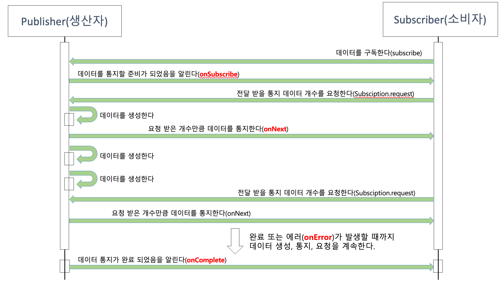

## 2. 리액티브 스트림즈
### 2.1 리액티브 스트림즈(Reactive streams) 란?
리액티브 코드를 작성하기 위한 표준 사양입니다. 데이터 스트림을 Non-blocking + Async 하게 처리하기 위하여 정의해 놓은 것입니다. 구현체로는 RxJava, Reactor, Akka Streams, Java 9 Flow API 등이 있습니다.

### 2.2 리액티브 스트림즈 구성요소 

리액티브 스트림즈를 통해 구현해야 하는 API 컴포넌트 목록은 아래와 같습니다.

1. Publisher : 데이터를 생성하고 Publish 하는 역할
2. Subscriber : 구독한 Publisher 로 부터 발행된 데이터를 전달받아 처리
3. Subscription : Publiser 에 요청할 데이터의 개수를 지정하고, 구독을 취소하는 역할도 함 
4. Processor : Publisher 과 Subscriber 의 기능을 모두 가지고 있음 

동작 과정을 살펴보면 

1. 먼저 Subscriber 은 전달받을 데이터를 구독(신청)합니다.
2. 이후 Publisher 은 데이터를 전달할 준비가 되었음을 Subscriber 에게 알립니다.
3. Subscriber 은 전달받기 원하는 데이터 개수를 Publisher 에게 요청합니다.
4. Publisher 은 요청받은 개수만큼 구독자에게 데이터를 전달합니다.
5. 위의 과정을 반복하다가 Publisher 가 모든 데이터를 전달하게 되면, 마지막으로 데이터 전송이 완료되었음을 구독자에게 알립니다. 혹은 실패해도 알리게 됩니다. 

### 2.3 코드로 보는 리액티브 스트림즈 컴포넌트 

#### 2.3.1 Publisher 

~~~java
public interface Publisher<T> {
  public void subscribe(Subscriber<? super T> s);
}
~~~

위의 subscribe 메서드는 파라미터로 전달받은 구독자를 등록하는 역할을 합니다.  
그런데 보다보면 왜 하필 퍼블리셔에 subscribe 메서드가 있을까 생각이 들 텐데, 퍼블리셔가 구독자를 직접 등록하는 형태로 해석하면 좋을 것 같습니다.

Kafka 에서는 한 토픽이 구독자와 퍼블리셔 사이에 있어서 느슨한 결합으로 서로 쏴주고 받기만 하면 된다면, 리액티브 스트림즈에서는 중간에 낀 컴포넌트 없이 서로 상호작용하는 구조이기 때문에 kafka 구독, 발행 모델과는 조금 다르게 생각해야 합니다.

#### 2.3.2 Subscriber 

~~~java
public interface Subscriber<T> {
  public void onSubscribe(Subscription s);
  public void onNext(T t);
  public void onError(Throwable t);
  public void onComplete();
}
~~~

- onSubscribe 메서드는 구독 시작 시점에 퍼블리셔에게 요청할 데이터 개수를 지정하거나 구독을 해지하는 것을 의미하며, 이는 파라미터의 Subscription 객체를 통하여 이루어 집니다.
- onNext 메서드는 퍼블리셔가 발행한 데이터를 처리하는 역할을 합니다. (Iterator 과 비슷한 개념입니다)
- onError 메서드는 퍼블리셔의 발행 과정에서 문제가 발생할 경우 에러를 처리합니다.
- onComplete 메서드는 퍼블리셔가 데이터 발행을 완료했음을 알리고, 해당 메서드에 정상 완료후 코드를 구현하면 됩니다.

#### 2.3.3 Subscription 

~~~java
public interface Subscription<T> {
  public void request(long n);
  public void cancel();
}
~~~

위 Subscriber 에서 언급한대로 Subscription 인터페이스는 구독자가 구독한 데이터의 개수를 요청하거나 구독 취소하는 역할을 합니다. 

#### 2.3.4 Processor

~~~java
public interface Processor<T, R> extends Subscriber<T>, Publisher<R> {

}
~~~

Processor 인터페이스에는 별도로 구현해야 하는 메서드는 없지만 코드를 보면 구독자와 퍼블리셔 모두를 상속한다는 것을 알 수 있습니다. 

### 2.4 리액티브 스트림즈 관련 용어 정리

#### 1. Signal 
구독자와 발행자간 상호간 주고받는 신호를 말합니다. 

#### 2. Demand
Subscriber 가 Publisher 에게 요청하는 데이터를 의미합니다.  
Publisher 가 아직 Subscriber 에게 전달하지 않았지만, 구독 요청한 데이터를 의미 합니다. 

#### 3. Emit
말그대로 데이터를 방출! 하는 과정입니다.
Subscriber 인터페이스에서 onNext 를 통해 데이터를 전달하는 Signal 을 데이터를 emit 한다고 표현합니다. 

#### 4. upstream / downstream 
코드로 바로 보는 것이 빠릅니다.

~~~java
public static void main(String[] args) {
  Flux
    .just(1, 2, 3, 4, 5, 6)
    .filter(n -> n % 2 == 0)
    .map(n -> n * 2)
    .subscribe(System.out.println);
}
~~~

데이터 스트림의 관점으로 볼 때, 위의 just 호출을 통해 반환된 Flux 는 filter 메서드 호출을 통해 반환된 Flux 가 더 하위에 있기 때문에 filter  Flux 는 Downstream 이 되고, filter 입장에서는 just 호출을 통해 반환된 Flux 가 자신보다 상위에 있기 때문에 Upstream 이 됩니다.

#### 5. Sequence 
4번의 코드처럼 다양한 연산으로 데이터의 연속 처리 흐름을 정의한 것이라고 생각하면 됩니다. 개인적으로는 kotlin standard library 의 Sequence 를 참고해도 좋다고 생각합니다.

#### 6. Operator
말이 필요 없습니다.  
just, filter, map 같은 메서드들을 Operator 라고 부릅니다. 
Stream API 나 코틀린의 map filter 등을 떠올리면 바로 감이 잡힐 것입니다.

#### 7. Source 
Data Source, Publisher, Source Flux 등 최초에 가장 먼저 생성된 무언가, 즉 데이터 원본이라고 생각하면 좋습니다. 

### 2.5 리액티브 스트림즈의 구현 규칙 

#### Publisher 구현을 위한 주요 기본 규칙 

1.	Publisher가 Subscriber에게 보내는 onNext signal의 총 개수는 항상 해당 Subscriber의 구독을 통해 요청된 데이터의 총 개수보다 더 작거나 같아야 한다.
2. Publisher는 요청된 것보다 적은 수의 onNext signal을 보내고 onComplete 또는 onError를 호출하여 구독을 종료할 수 있다.
3.	Publisher의 데이터 처리가 실패하면 onError signal을 보내야 한다.
4.	Publisher의 데이터 처리가 성공적으로 종료되면 onComplete signal을 보내야 한다.
5.	Publisher가 Subscriber에게 onError 또는 onComplete signal을 보내는 경우 해당 Subscriber의 구독은 취소된 것으로 간주되어야 한다.
6.	일단 종료 상태 signal을 받으면(onError, onComplete) 더 이상 signal이 발생되지 않아야 한다.
7.	구독이 취소되면 Subscriber는 결국 signal을 받는 것을 중지해야 한다.

#### Subscriber 구현을 위한 주요 기본 규칙 
1. Subscriber는 Publisher로부터 onNext signal을 수신하기 위해 Subscription.request(n)를 통해 Demand signal을 Publisher에게 보내야 한다.
2. Subscriber.onComplete() 및 Subscriber.onError(Throwable t)는 Subscription 또는 Publisher의 메서드를 호출해서는 안된다.
3. Subscriber.onComplete() 및 Subscriber.onError(Throwable t)는 signal을 수신한 후 구독이 취소된 것으로 간주해야 한다.
4. 구독이 더 이상 필요하지 않은 경우 Subscribersms Subscriber.cancel()을 호출해야 한다.
5. Subscriber.onSubscribe()는 지정된 Subscriber에 대해 최대 한 번만 호출되어야 한다.

#### Subscription 구현을 위한 주요 기본 규칙 
1. 구독은 Subscriber가 onNext 또는 onSubscribe 내에서 동기적으로 Subscription.request를 호출하도록 허용해야 한다.
2. 구독이 취소된 후 추가적으로 호출되는 Subscription.request(long n)는 효력이 없어야 한다.
3. 구독이 취소된 후 추가적으로 호출되는 Subscription.cancel()은 효력이 없어야 한다.
4. 구독이 취소되지 않은 동안 Subscription.request(long n)의 매개변수가 0보다 작거나 같으면 java.lang.IllegalArgumentException과 함께 onError signal을 보내야 한다.
5. 구독이 취소되지 않은 동안 Subscription.cancel()은 Publisher가 Subscriber에게 보내는 signal을 결국 중지하도록 요청해야 한다.
6. 구독이 취소되지 않은 동안 Subscription.cancel()은 Publisher에게 해당 구독자에 대한 참조를 결국 삭제하도록 요청해야 한다.
7. Subscription.cancel(), Subscription.request() 호출에 대한 응답으로 예외를 던지는 것을 허용하지 않는다.
8. 구독은 무제한 수의 request 호출을 지원해야 하고 최대 263-1개의 Demand를 지원해야 한다.