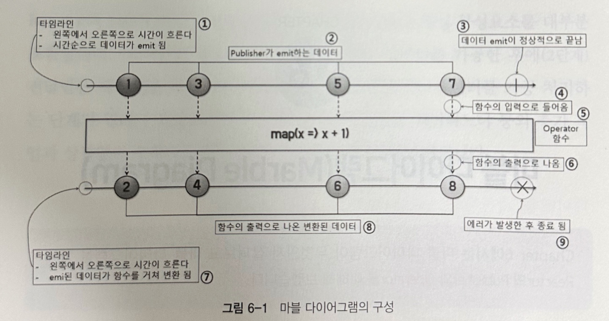
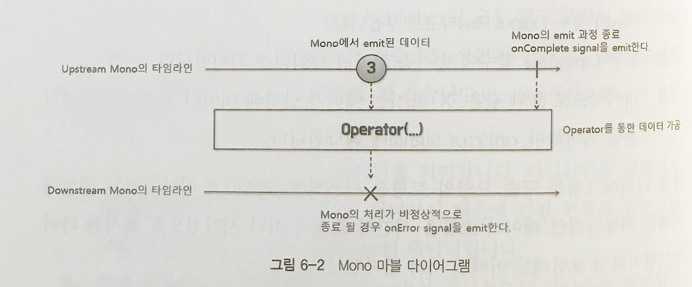
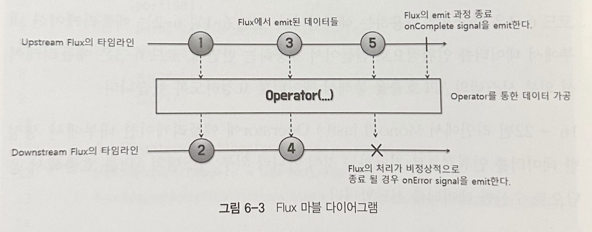
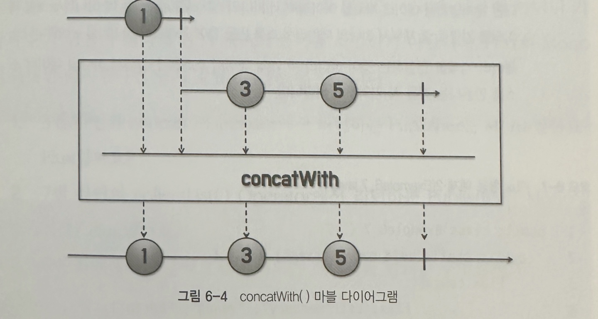

## 6. 마블 다이어그램 

### 6.1 마블 다이어그램 이란?

마블 다이어그램은 비동기적인 데이터 흐름을 시간의 흐름에 따라 시각적으로 표시한 다이어그램 입니다.

1. 다이어그램에는 두가지 타임라인이 존재하며, 첫번째는 1번처럼 Publisher 가 데이터를 emit 하는 타임라인 입니다. 
2. Publisher 가 emit 하는 데이터 입니다, 가장 왼쪽이 시간상으로 가장 먼저 emit 된 데이터 입니다. 
3. 수직으로 된 bar 은 모든 data 의 emit 이 정상적으로 끝났음을 의미하고, onComplete 시그널에 해당합니다.
4. Operator 함수로 들어가는 점선은 Publisher 로 부터 emit 된 데이터가 Operator 의 입력으로 들어가는 것을 의미합니다.
5. Operator 함수를 나타냅니다. 위의 그림은 map Operator 을 나타냅니다.
6. Operator 함수에서 리턴된 새로운 Publisher(mono / flux) 를 이용해 다운스트림에 가공된 데이터를 전달하는 것을 의미합니다.
7. Operator 에서 가공 처리된 데이터의 타임라인입니다.
8. 가공 처리된 데이터를 의미합니다.
9. X 표시는 onError 시그널을 의미합니다.

### 6.2 마블 다이어그램으로 Reactor 의 Publisher 이해하기

#### 1. Mono Publisher 

Mono 퍼블리셔를 이용하여 데이터를 emit 하는 과정이며, X 표시를 통하여 onError 시그널을 emit 했다는 사실을 알 수 있습니다.

~~~java
public class Example6_2 {
    public static void main(String[] args) {
        Mono
            .empty()
            .subscribe(
                    none -> System.out.println("# emitted onNext signal"), // Publisher 가 onNext signal 을 전송하면 실행됨, 구독자가 퍼블리셔로부터 데이터를 전달받을 때 사용 
                    error -> {}, //Error 을 전달받기 위해 사용 
                    () -> System.out.println("# emitted onComplete signal") // data emit 이 정상적으로 끝나 후처리를 하고 싶을 때 
            );
    }
}
~~~

- 6-2 번 코드의 설명이 뭔가 이상합니다, 내용의 주석 같은 부분이 없는데.. 

~~~java
public class Example6_3 {
    public static void main(String[] args) {
        URI worldTimeUri = UriComponentsBuilder.newInstance().scheme("http")
                .host("worldtimeapi.org")
                .port(80)
                .path("/api/timezone/Asia/Seoul")
                .build()
                .encode()
                .toUri();

        RestTemplate restTemplate = new RestTemplate();
        HttpHeaders headers = new HttpHeaders();
        headers.setAccept(Collections.singletonList(MediaType.APPLICATION_JSON));

        Mono.just(
                    restTemplate
                            .exchange(worldTimeUri,
                                    HttpMethod.GET,
                                    new HttpEntity<String>(headers),
                                    String.class)
                )
                .map(response -> {
                    DocumentContext jsonContext = JsonPath.parse(response.getBody());
                    String dateTime = jsonContext.read("$.datetime");
                    return dateTime;
                })
                .subscribe(
                        data -> System.out.println("# emitted data: " + data),
                        error -> {
                            System.out.println(error);
                        },
                        () -> System.out.println("# emitted onComplete signal")
                );
    }
}
~~~

- Mono 퍼블리셔가 API 요청으로 한건의 데이터를 emit 하고 있고
- map Operator 에서 해당 데이터를 파싱하고 
- Subscriber 은 해당 데이터를 구독하여 처리합니다.
- 위의 예제에서는 restTemplate 을 사용하여 Non-blocking 효과가 없지만 체이닝 하여 깔끔하게 처리했다는 것만 보면 됩니다.

#### 2. Flux Publisher 

Flux 의 마블 다이어그램을 보면 Mono 와 달리 타임라인 구슬의 개수가 여러개입니다.
이전 챕터에서 설명한 대로 Flux 퍼블리셔는 여러개의 데이터를 emit 할 수 있습니다.

##### 기본 예제들 

~~~java
public class Example6_4 {
    public static void main(String[] args) {
        Flux.just(6, 9, 13)
                .map(num -> num % 2)
                .subscribe(System.out::println);
    }
}
~~~

~~~java
public class Example6_5 {
    public static void main(String[] args) {
        Flux.fromArray(new Integer[]{3, 6, 7, 9})
                .filter(num -> num > 6)
                .map(num -> num * 2)
                .subscribe(System.out::println);
    }
}
~~~

##### 두개의 Mono 를 연결하여 Flux 로 반환하는 예제 

~~~java
public class Example6_6 {
    public static void main(String[] args) {
        Flux<String> flux =
                Mono.justOrEmpty("Steve")
                        .concatWith(Mono.justOrEmpty("Jobs"));
        flux.subscribe(System.out::println);
    }
}
~~~

위 코드를 마블 다이어그램으로 나타내면 아래와 같습니다.

