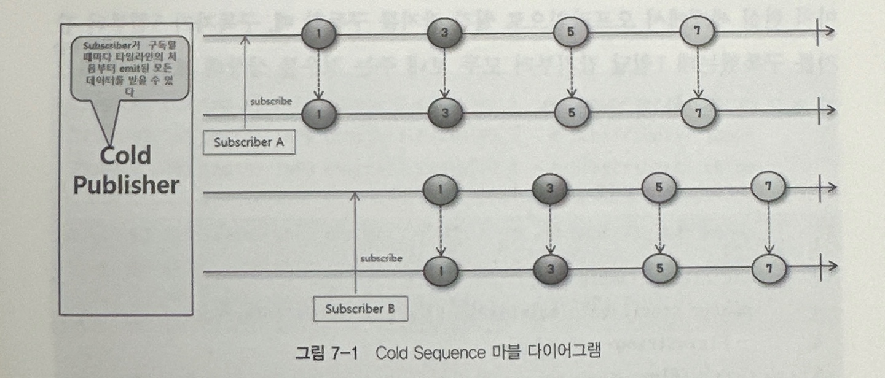
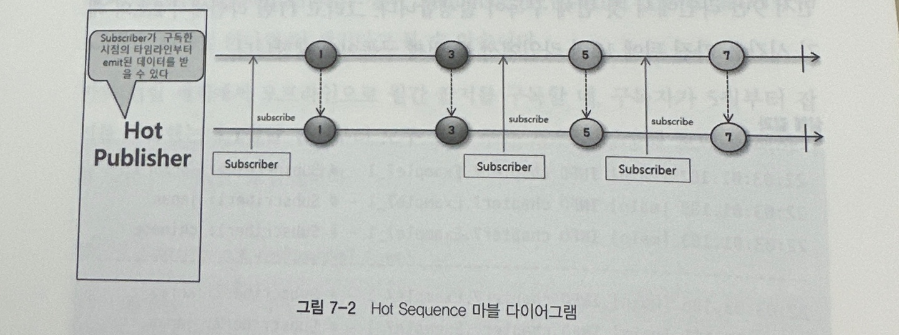

## 7. Cold Sequnce 와 Hot Sequence

### 7.1 Cold 와 Hot 의 의미 
> Cold 는 무언가를 새로 시작하고, Hot 은 무언가를 새로 시작하지 않는 것

### 7.2 Cold Sequence 
Cold Sequence 는 구독자가 구독할 때마다 데이터 흐름이 처음부터 시작되는 시퀀스입니다. 

위의 마블 다이어그램처럼, Subscriber A 와 Subscriber B 의 구독 시점이 다르지만 A, B 는 모두 동일한 데이터를 전달 받는것을 알 수 있습니다.

아래는 코드 예제입니다.

~~~java
/**
 * Cold Sequence 예제
 */
@Slf4j
public class Example7_1 {
    public static void main(String[] args) throws InterruptedException {

        Flux<String> coldFlux =
                Flux
                    .fromIterable(Arrays.asList("KOREA", "JAPAN", "CHINESE"))
                    .map(String::toLowerCase);

        coldFlux.subscribe(country -> log.info("# Subscriber1: {}", country));
        System.out.println("----------------------------------------------------------------------");
        Thread.sleep(2000L);
        coldFlux.subscribe(country -> log.info("# Subscriber2: {}", country));
    }
}
~~~

### 7.3 Hot Sequence 
Hot Sequence 는 Cold 와 달리 구독이 발생한 시점 이전에 이미 emit 된 데이터는 구독자가 전달받지 못하고 구독 이후의 데이터만 전달받을 수 있습니다.

Cold 와 달리 위 다이어그램에서는 구독이 이루어질때마다 타임라인이 새로 생성되지 않고, 타임라인이 하나인 것을 알 수 있습니다. 

아래는 코드 예제입니다.

~~~java
/**
 * Hot Sequence 예제
 */
@Slf4j
public class Example7_2 {
    public static void main(String[] args) throws InterruptedException {
        String[] singers = {"Singer A", "Singer B", "Singer C", "Singer D", "Singer E"};

        log.info("# Begin concert:");
        Flux<String> concertFlux =
                Flux
                    .fromArray(singers)
                    .delayElements(Duration.ofSeconds(1))
                    .share();

        concertFlux.subscribe(
                singer -> log.info("# Subscriber1 is watching {}'s song", singer)
        );

        Thread.sleep(2500);

        concertFlux.subscribe(
                singer -> log.info("# Subscriber2 is watching {}'s song", singer)
        );

        Thread.sleep(3000);
    }
}
~~~

위 코드에서 `.share()` 은 Cold Seq 를 Hot Seq 으로 동작하게 해주는 Operator 입니다.
상위 스트림인 fromArray 에서 받은 원본 Flux를 공유(멀티캐스트) 한다는 의미 입니다.

### 7.4 HTTP 요청과 응답에서 Cold Sequence 와 Hot Sequence 의 동작 흐름

~~~java
@Slf4j
public class Example7_4 {
    public static void main(String[] args) throws InterruptedException {
        URI worldTimeUri = UriComponentsBuilder.newInstance().scheme("http")
                .host("worldtimeapi.org")
                .port(80)
                .path("/api/timezone/Asia/Seoul")
                .build()
                .encode()
                .toUri();

        Mono<String> mono = getWorldTime(worldTimeUri).cache();
        mono.subscribe(dateTime -> log.info("# dateTime 1: {}", dateTime));
        Thread.sleep(2000);
        mono.subscribe(dateTime -> log.info("# dateTime 2: {}", dateTime));

        Thread.sleep(2000);
    }

    private static Mono<String> getWorldTime(URI worldTimeUri) {
        return WebClient.create()
                .get()
                .uri(worldTimeUri)
                .retrieve()
                .bodyToMono(String.class)
                .map(response -> {
                    DocumentContext jsonContext = JsonPath.parse(response);
                    String dateTime = jsonContext.read("$.datetime");
                    return dateTime;
                });
    }
}
~~~

Cold Sequence 부분의 코드는 매우 직관적이기 때문에 Hot 만 살펴 본다면..

위의 코드에서 `cache()` Operator 을 볼 수 있는데, 해당 오퍼레이터는 Cold 시퀀스로 동작하는 mono 를 Hot 시퀀스로 변경해 주고  
데이터가 emit 될 때 캐싱한 뒤 이후 구독이 발생할 때 마다 캐시된 데이터를 전달합니다.