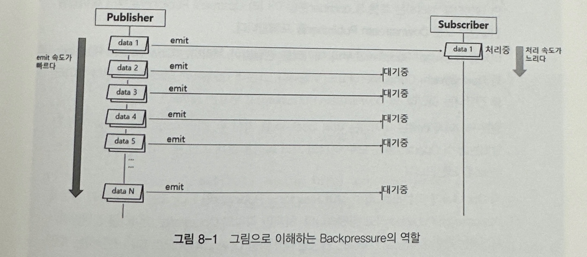
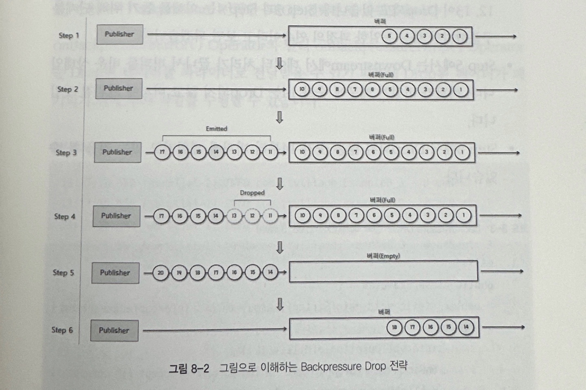
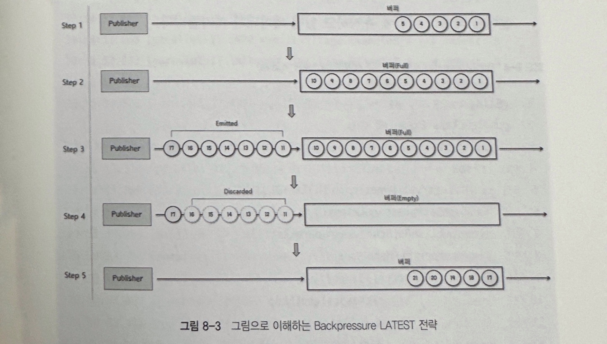
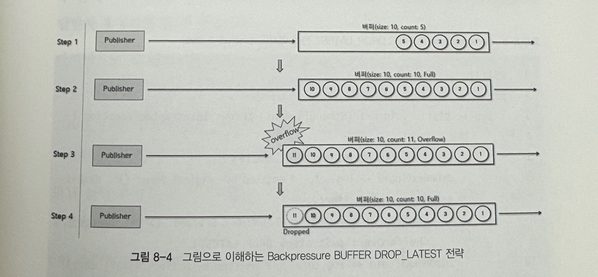

## 8. Backpressure

### 8.1 Backpressure 란?

> Publisher가 끊임없이 emit하는 데이터를 적절히 제어하여 데이터 처리에 과부하가 걸리지 않도록 하는 제어가 Backpressure(배압) 입니다.

그림처럼 구독자측에서 해당 데이터를 처리하는데 지연이 있다면 퍼블리셔가 emit 한 데이터들이 적체되어 문제가 발생할 것입니다. 참고로 구독자 뿐 아니라 상위 스트림의 퍼블리셔로 부터 데이터를 전달받는 다운스트림 퍼블리셔도 같은 문제를 겪을 수 있습니다

### 8.2 Reactor 에서의 Backpressure 처리 방식

#### 8.2.1 데이터 개수 제어
첫번째 방식은 애초에 구독자가 적절히 처리할 수 있는 수준의 데이터 개수를 직접 퍼블리셔에게 요청하는 것입니다. 

~~~java
@Slf4j
public class Example8_1 {
    public static void main(String[] args) {
        Flux.range(1, 5)
            .doOnRequest(data -> log.info("# doOnRequest: {}", data))
            .subscribe(new BaseSubscriber<Integer>() {
                @Override
                protected void hookOnSubscribe(Subscription subscription) {
                    request(1);
                }

                @SneakyThrows
                @Override
                protected void hookOnNext(Integer value) {
                    Thread.sleep(2000L);
                    log.info("# hookOnNext: {}", value);
                    request(1);
                }
            });
    }
}
~~~

- 코드에서처럼 subscribe 메서드로 람다 표현식 대신에 BaseSubscriber 객체를 전달합니다.
- hookOnSubscribe 메서드로 최소 데이터 요청 개수를 제어합니다
- hookOnNext 메서드는 emit 된 데이터를 전달받아 처리하고 퍼블리셔에서 또다시 데이터를 요청합니다.

#### 8.2.2 백프레셔 전략 사용 

Reactor 에서 제공하는 여러가지 백프레셔 전략을 사용하는 방법도 있습니다. 

##### 1. IGNORE 전략 
백프레셔를 적용하지 않습니다.

##### 2. ERROR 전략 
다운스트림의 데이터 처리 속도가 느려 업스트림 emit 속도를 따라가지 못하는 경우 예외(illegalStateException)를 발생시킵니다.  
이 경우 퍼블리셔는 에러 시그널을 구독자에게 전송하고 삭제된 데이터는 폐기합니다. 

~~~java
@Slf4j
public class Example8_2 {
    public static void main(String[] args) throws InterruptedException {
        Flux
            .interval(Duration.ofMillis(1L))
            .onBackpressureError()
            .doOnNext(data -> log.info("# doOnNext: {}", data))
            .publishOn(Schedulers.parallel())
            .subscribe(data -> {
                        try {
                            Thread.sleep(5L);
                        } catch (InterruptedException e) {}
                        log.info("# onNext: {}", data);
                    },
                    error -> log.error("# onError", error));

        Thread.sleep(2000L);
    }
}
~~~

##### 3. DROP 전략 
DROP 전략은 퍼블리셔가 다운스트림으로 전달할 데이터가 버퍼에 가득 찼을때 버퍼 밖에서 대기중인 데이터 중에서 먼저 emit 된 데이터부터 Drop 시킵니다.

~~~java
@Slf4j
public class Example8_3 {
    public static void main(String[] args) throws InterruptedException {
        Flux
            .interval(Duration.ofMillis(1L))
            .onBackpressureDrop(dropped -> log.info("# dropped: {}", dropped))
            .publishOn(Schedulers.parallel())
            .subscribe(data -> {
                        try {
                            Thread.sleep(5L);
                        } catch (InterruptedException e) {}
                        log.info("# onNext: {}", data);
                    },
                    error -> log.error("# onError", error));

        Thread.sleep(2000L);
    }
}
~~~

##### 4. LATEST 전략
퍼블리셔가 다운스트림으로 전달할 데이터가 버퍼가 가득 찰 경우 버퍼 밖에서 대기중인 데이터 중에서 가장 최근에 emit 된 데이터부터 버퍼에 채우는 전략입니다.  

그림처럼 새로운 데이터가 들어오는 시점에 가장 최근의 데이터만 남겨두고 나머지 데이터를 모두 폐기합니다

~~~java
@Slf4j
public class Example8_4 {
    public static void main(String[] args) throws InterruptedException {
        Flux
            .interval(Duration.ofMillis(1L))
            .onBackpressureLatest()
            .publishOn(Schedulers.parallel())
            .subscribe(data -> {
                        try {
                            Thread.sleep(5L);
                        } catch (InterruptedException e) {}
                        log.info("# onNext: {}", data);
                    },
                    error -> log.error("# onError", error));

        Thread.sleep(2000L);
    }
}
~~~

##### 5. BUFFER 전략
해당 전략은 버퍼의 데이터를 폐기하지 ㅇ낳고 버퍼링을 하는 전략도 지원하지만, 버퍼가 가득 차면 폐기하는 전략 혹은 에러를 발생시키는 전략도 사용합니다.

##### 6. BUFFER - DROP_LATEST 전략 
퍼블리셔가 다운스트림으로 전달할 데이터가 버퍼에 가득 찰 경우 가장 최근에 버퍼안에 채워진 데이터를 Drop 하여 폐기한 후, 확보된 공간에 emit 된 데이터를 채우는 전략입니다.

~~~java
/**
 * Unbounded request 일 경우, Downstream 에 Backpressure Buffer DROP_LATEST 전략을 적용하는 예제
 *  - Downstream 으로 전달 할 데이터가 버퍼에 가득 찰 경우,
 *    버퍼 안에 있는 데이터 중에서 가장 최근에(나중에) 버퍼로 들어온 데이터부터 Drop 시키는 전략
 */
@Slf4j
public class Example8_5 {
    public static void main(String[] args) throws InterruptedException {
        Flux
            .interval(Duration.ofMillis(300L))
            .doOnNext(data -> log.info("# emitted by original Flux: {}", data))
            .onBackpressureBuffer(2,
                    dropped -> log.info("** Overflow & Dropped: {} **", dropped),
                    BufferOverflowStrategy.DROP_LATEST)
            .doOnNext(data -> log.info("[ # emitted by Buffer: {} ]", data))
            .publishOn(Schedulers.parallel(), false, 1)
            .subscribe(data -> {
                        try {
                            Thread.sleep(1000L);
                        } catch (InterruptedException e) {}
                        log.info("# onNext: {}", data);
                    },
                    error -> log.error("# onError", error));

        Thread.sleep(2500L);
    }
}
~~~

##### 7. BUFFER - DROP_OLDEST 전략 
퍼블리셔가 Downstream 으로 전달 할 데이터가 버퍼에 가득 찰 경우, 버퍼 안에 있는 데이터 중에서 가장 먼저 버퍼로 들어온 오래된 데이터부터 Drop 시키는 전략입니다.

~~~java
/**
 * Unbounded request 일 경우, Downstream 에 Backpressure Buffer DROP_OLDEST 전략을 적용하는 예제
 *  - Downstream 으로 전달 할 데이터가 버퍼에 가득 찰 경우,
 *    버퍼 안에 있는 데이터 중에서 가장 먼저 버퍼로 들어온 오래된 데이터부터 Drop 시키는 전략
 */
@Slf4j
public class Example8_6 {
    public static void main(String[] args) throws InterruptedException {
        Flux
            .interval(Duration.ofMillis(300L))
            .doOnNext(data -> log.info("# emitted by original Flux: {}", data))
            .onBackpressureBuffer(2,
                    dropped -> log.info("** Overflow & Dropped: {} **", dropped),
                    BufferOverflowStrategy.DROP_OLDEST)
            .doOnNext(data -> log.info("[ # emitted by Buffer: {} ]", data))
            .publishOn(Schedulers.parallel(), false, 1)
            .subscribe(data -> {
                        try {
                            Thread.sleep(1000L);
                        } catch (InterruptedException e) {}
                        log.info("# onNext: {}", data);
                    },
                    error -> log.error("# onError", error));

        Thread.sleep(2500L);
    }
}
~~~
