## 14. Operator

### 14.2 Sequence 생성을 위한 오퍼레이터 

#### justOrEmpty
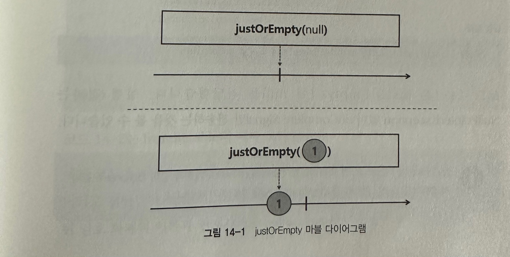

- emit 된 데이터가 null 이면 예외가 아니라 onComplete 시그널 전송
- emit 된 데이터가 null 아닌 경우 해당 data emit 하는 Mono 생성

Example 14.1
~~~java
@Slf4j
public class Example14_1 {
    public static void main(String[] args) {
        Mono
            .justOrEmpty(null)
            .subscribe(data -> {},
                    error -> {},
                    () -> log.info("# onComplete"));
    }
}
~~~

#### fromIterable
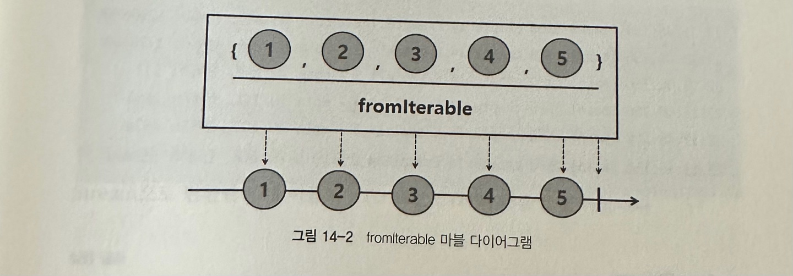

- java 에서 제공하는 Iterable 구현체를 파라미터로 Flux 생성 

Example 14.2
~~~java
/**
 * fromIterable 예제
 */
@Slf4j
public class Example14_2 {
    public static void main(String[] args) {
        Flux
                .fromIterable(SampleData.coins)
                .subscribe(coin ->
                        log.info("coin 명: {}, 현재가: {}", coin.getT1(), coin.getT2())
                );
    }
}
~~~

#### fromStream
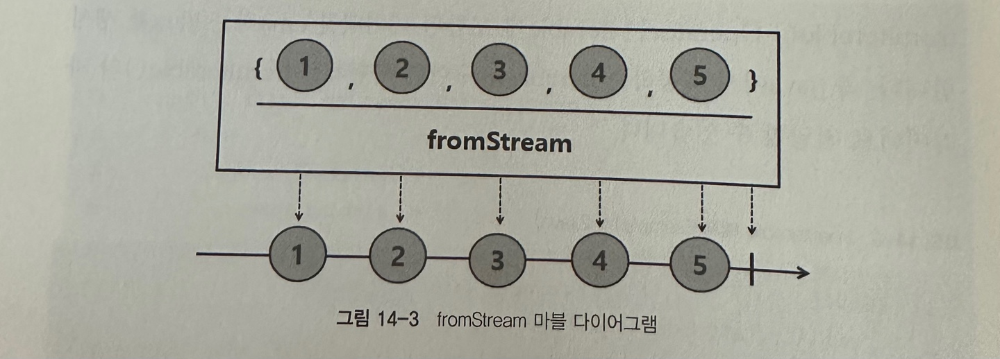

- Stream 에 포함된 데이터를 emit 하는 Flux 생성
- 자바 스트림은 재사용 불가

Example 14.3
~~~java
@Slf4j
public class Example14_3 {
    public static void main(String[] args) {
        Flux
            .fromStream(() -> SampleData.coinNames.stream())
            .filter(coin -> coin.equals("BTC") || coin.equals("ETH"))
            .subscribe(data -> log.info("{}", data));
    }
}
~~~

#### range(n,m)
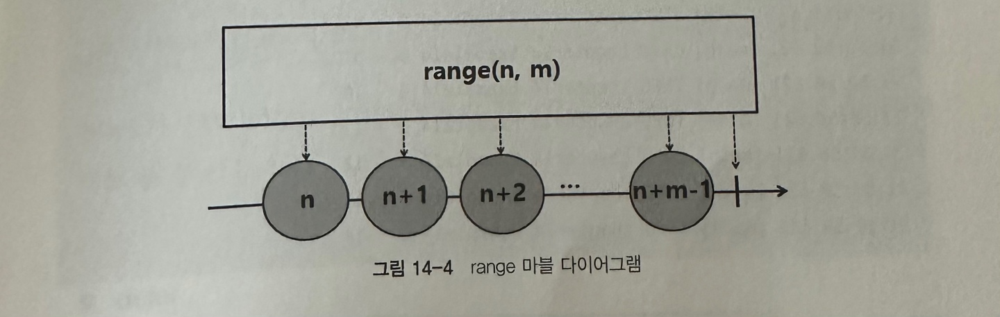

- n부터 1씩 증가한 연속된 수를 m 개 emit 하는 flux 생성
- for문처럼 사용가능

Example 14.4
~~~java
/**
 * range 예제
 */
@Slf4j
public class Example14_4 {
    public static void main(String[] args) {
        Flux
            .range(5, 10)
            .subscribe(data -> log.info("{}", data));
    }
}
~~~

Example 14.5
~~~java
/**
 * range 예제
 */
@Slf4j
public class Example14_5 {
    public static void main(String[] args) {
        Flux
            .range(7, 5)
            .map(idx -> SampleData.btcTopPricesPerYear.get(idx))
            .subscribe(tuple -> log.info("{}'s {}", tuple.getT1(), tuple.getT2()));
    }
}
~~~

#### defer
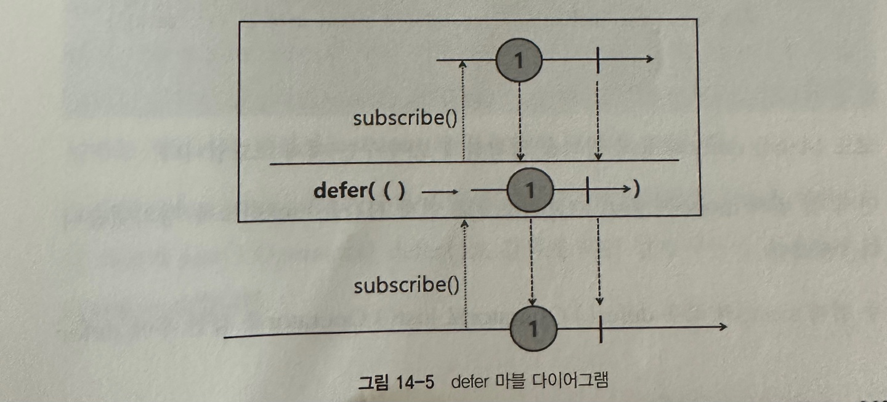

- Operator 구독 시점에 data emit 하는 Flux 또는 Mono 생성
- defer 은 데이터 emit 을 지연시켜 필요한 시점에 data 를 emit 

Example 14.6
~~~java
/**
 * defer 예제
 */
@Slf4j
public class Example14_6 {
    public static void main(String[] args) throws InterruptedException {
        log.info("# start: {}", LocalDateTime.now());
        Mono<LocalDateTime> justMono = Mono.just(LocalDateTime.now());
        Mono<LocalDateTime> deferMono = Mono.defer(() ->
                                                    Mono.just(LocalDateTime.now()));

        Thread.sleep(2000);

        justMono.subscribe(data -> log.info("# onNext just1: {}", data));
        deferMono.subscribe(data -> log.info("# onNext defer1: {}", data));

        Thread.sleep(2000);

        justMono.subscribe(data -> log.info("# onNext just2: {}", data));
        deferMono.subscribe(data -> log.info("# onNext defer2: {}", data));
    }
}
~~~
- just Operator 은 hot publisher 라 구독여부 상관없이 emit
- 따라서 defer Operator 을 써서 구독 전까지 emit 을 지연시킨다

Example 14.7
~~~java
/**
 * defer 예제
 */
@Slf4j
public class Example14_7 {
    public static void main(String[] args) throws InterruptedException {
        log.info("# start: {}", LocalDateTime.now());
        Mono
            .just("Hello")
            .delayElement(Duration.ofSeconds(3))
            .switchIfEmpty(sayDefault())
//            .switchIfEmpty(Mono.defer(() -> sayDefault()))
            .subscribe(data -> log.info("# onNext: {}", data));

        Thread.sleep(3500);
    }

    private static Mono<String> sayDefault() {
        log.info("# Say Hi");
        return Mono.just("Hi");
    }
}
~~~

#### using
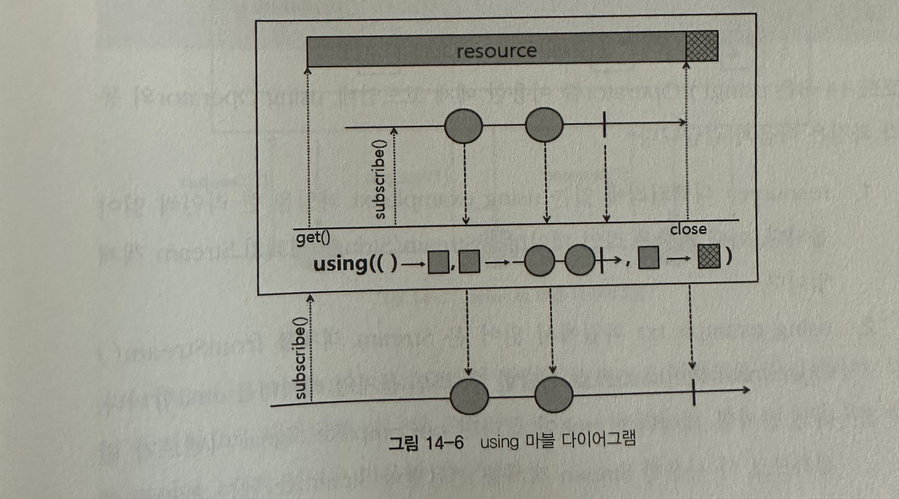

- 파라미터로 전달받은 resource 를 emit 하는 Flux 생성
- 첫번째 파라미터는 읽어 올 리소스
- 두번째 파라미터는 읽어 온 리소소를 emit 하는 Flux
- 세번째 파라미터는 종료 Signal 이 발생할 경우 resource 해제 등 후처리

Example 14.8
~~~java
/**
 * using 예제
 */
@Slf4j
public class Example14_8 {
    public static void main(String[] args) {
        Path path = Paths.get("D:\\resources\\using_example.txt");

        Flux
            .using(() -> Files.lines(path), Flux::fromStream, Stream::close)
            .subscribe(log::info);
    }
}
~~~

- 파일을 한줄씩 읽어 스트림 데이터로 emit 하고 스트림 종료 

#### generate
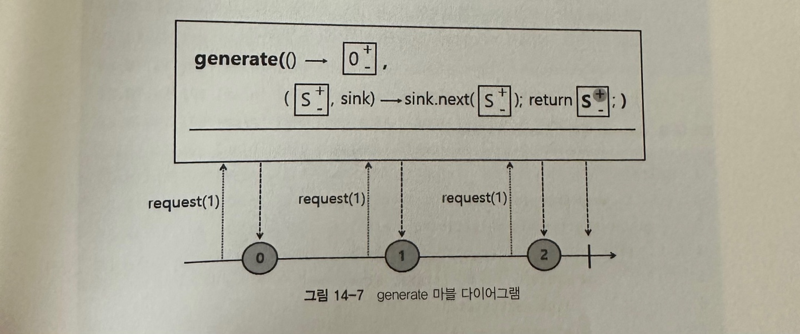

- generate 오퍼레이터는 프로그래밍 방식으로 시그널 이벤트 발생시킴
- 동기적으로 데이터를 하나씩 순차 emit 할 경우 사용됨

Example 14.9
~~~java
/**
 * generate 예제
 */
@Slf4j
public class Example14_9 {
    public static void main(String[] args) {
        Flux
            .generate(() -> 0, (state, sink) -> {
                sink.next(state);
                if (state == 10)
                    sink.complete();
                return ++state;
            })
            .subscribe(data -> log.info("# onNext: {}", data));
    }
}
~~~

- generate 의 첫번째 파라미터에서 초기값을 0으로 지정했음
- 두번째 파라미터에서 전달받은 SynchronousSink 객체로 상태 값 emit 
- SynchronousSink 는 하나의 Signal 만 동기적으로 발생시킬 수 있으며 하나의 상태 값만 emit 하는 인터페이스 

Example 14.10
~~~java
/**
 * generate 예제
 */
@Slf4j
public class Example14_10 {
    public static void main(String[] args) {
        final int dan = 3;
        Flux
            .generate(() -> Tuples.of(dan, 1), (state, sink) -> {
                sink.next(state.getT1() + " * " +
                        state.getT2() + " = " + state.getT1() * state.getT2());
                if (state.getT2() == 9)
                    sink.complete();
                return Tuples.of(state.getT1(), state.getT2() + 1);
            }, state -> log.info("# 구구단 {}단 종료!", state.getT1()))
            .subscribe(data -> log.info("# onNext: {}", data));
    }
}
~~~

Example 14.11
~~~java
/**
 * generate 예제
 */
@Slf4j
public class Example14_11 {
    public static void main(String[] args) {
        Map<Integer, Tuple2<Integer, Long>> map =
                                            SampleData.getBtcTopPricesPerYearMap();
        Flux
                .generate(() -> 2019, (state, sink) -> {
                    if (state > 2021) {
                        sink.complete();
                    } else {
                        sink.next(map.get(state));
                    }

                    return ++state;
                })
                .subscribe(data -> log.info("# onNext: {}", data));
    }
}
~~~

#### create
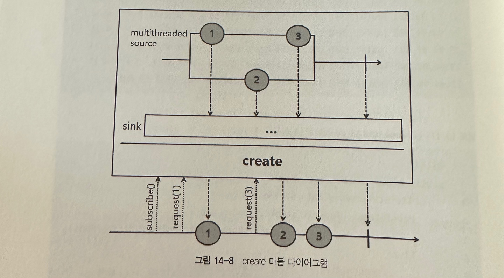

- generate 오퍼레이터 처럼 프로그래밍 방식으로 시그널 발생시킴
- generate 오퍼레이터는 데이터를 동기적으로 한번에 한건씩 emit 
- create 오퍼레이터는 비동기적으로 여러건 데이터 한꺼번에 emit 가능

Example 14.12
~~~java
/**
 * create 예제
 *  - pull 방식
 */
@Slf4j
public class Example14_12 {
    static int SIZE = 0;
    static int COUNT = -1;
    final static List<Integer> DATA_SOURCE = Arrays.asList(1, 2, 3, 4, 5, 6, 7, 8, 9, 10);

    public static void main(String[] args) {
        log.info("# start");
        Flux.create((FluxSink<Integer> sink) -> {
            sink.onRequest(n -> {
                try {
                    Thread.sleep(1000L);
                    for (int i = 0; i < n; i++) {
                        if (COUNT >= 9) {
                            sink.complete();
                        } else {
                            COUNT++;
                            sink.next(DATA_SOURCE.get(COUNT));
                        }
                    }
                } catch (InterruptedException e) {}
            });

            sink.onDispose(() -> log.info("# clean up"));
        }).subscribe(new BaseSubscriber<>() {
            @Override
            protected void hookOnSubscribe(Subscription subscription) {
                request(2);
            }

            @Override
            protected void hookOnNext(Integer value) {
                SIZE++;
                log.info("# onNext: {}", value);
                if (SIZE == 2) {
                    request(2);
                    SIZE = 0;
                }
            }

            @Override
            protected void hookOnComplete() {
                log.info("# onComplete");
            }
        });
    }
}
~~~

Example 14.13
~~~java
/**
 * create 예제
 *  - push 방식
 */
@Slf4j
public class Example14_13 {
    public static void main(String[] args) throws InterruptedException {
        CryptoCurrencyPriceEmitter priceEmitter = new CryptoCurrencyPriceEmitter();

        Flux.create((FluxSink<Integer> sink) ->
                        priceEmitter.setListener(new CryptoCurrencyPriceListener() {
            @Override
            public void onPrice(List<Integer> priceList) {
                priceList.stream().forEach(price -> {
                    sink.next(price);
                });
            }

            @Override
            public void onComplete() {
                sink.complete();
            }
        }))
        .publishOn(Schedulers.parallel())
        .subscribe(
            data -> log.info("# onNext: {}", data),
            error -> {},
            () -> log.info("# onComplete"));

        Thread.sleep(3000L);

        priceEmitter.flowInto();

        Thread.sleep(2000L);
        priceEmitter.complete();
    }
}
~~~

Example 14.14
~~~java
/**
 * create 예제
 *  - Backpressure 전략 적용
 */
@Slf4j
public class Example14_14 {
    static int start = 1;
    static int end = 4;

    public static void main(String[] args) throws InterruptedException {
        Flux.create((FluxSink<Integer> emitter) -> {
            emitter.onRequest(n -> {
                log.info("# requested: " + n);
                try {
                    Thread.sleep(500L);
                    for (int i = start; i <= end; i++) {
                        emitter.next(i);
                    }
                    start += 4;
                    end += 4;
                } catch (InterruptedException e) {}
            });

            emitter.onDispose(() -> {
                log.info("# clean up");
            });
        }, FluxSink.OverflowStrategy.DROP)
        .subscribeOn(Schedulers.boundedElastic())
        .publishOn(Schedulers.parallel(), 2)
        .subscribe(data -> log.info("# onNext: {}", data));

        Thread.sleep(3000L);
    }
}
~~~

### 14.3 Sequence 필터링 Operator 

#### filter
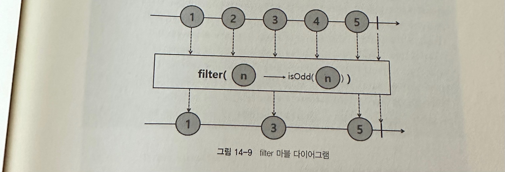

- 업스트림에서 emit된 데이터 중에서 조건에 일치하는 데이터만 다운스트림으로 emit 
- filter 파라미터로 입력받은 Predicate 리턴 값이 True 인 데이터만 다운스트림으로 emit 

Example 14.15
~~~java
/**
 * filter 예제
 */
@Slf4j
public class Example14_15 {
    public static void main(String[] args) {
        Flux
            .range(1, 20)
            .filter(num -> num % 2 != 0)
            .subscribe(data -> log.info("# onNext: {}", data));
    }
}
~~~

Example 14.16
~~~java
/**
 * filter 예제
 */
@Slf4j
public class Example14_16 {
    public static void main(String[] args) {
        Flux
            .fromIterable(SampleData.btcTopPricesPerYear)
            .filter(tuple -> tuple.getT2() > 20_000_000)
            .subscribe(data -> log.info(data.getT1() + ":" + data.getT2()));
    }
}
~~~

Example 14.17
~~~java
/**
 * filterWhen 예제
 */
@Slf4j
public class Example14_17 {
    public static void main(String[] args) throws InterruptedException {
        Map<CovidVaccine, Tuple2<CovidVaccine, Integer>> vaccineMap =
                                                                getCovidVaccines();
        Flux
            .fromIterable(SampleData.coronaVaccineNames)
            .filterWhen(vaccine -> Mono
                                    .just(vaccineMap.get(vaccine).getT2() >= 3_000_000)
                                    .publishOn(Schedulers.parallel()))
            .subscribe(data -> log.info("# onNext: {}", data));

        Thread.sleep(1000);
    }
}
~~~

#### skip
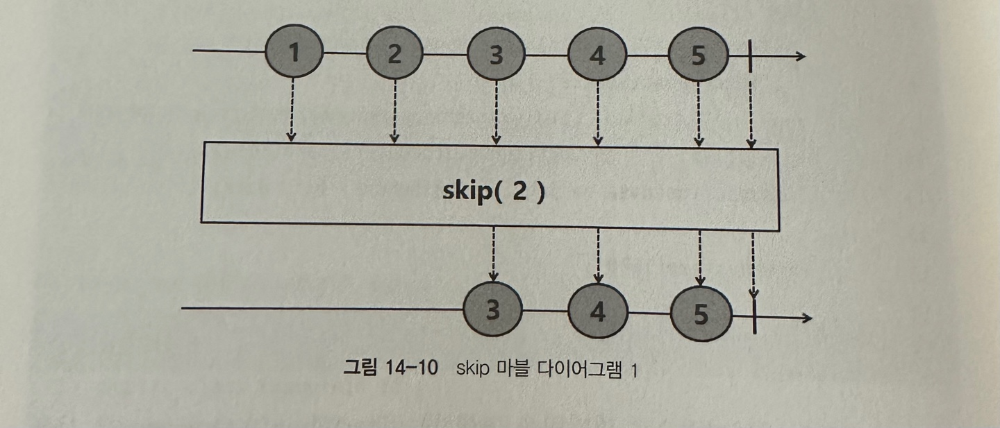

- skip operator 은 업스트림에서 emit 된 데이터 중에서 파라미터로 입력받은 숫자만큼 건너뛴 후 emit 

Example 14.18
~~~java
/**
 * skip 예제
 */
@Slf4j
public class Example14_18 {
    public static void main(String[] args) throws InterruptedException {
        Flux
            .interval(Duration.ofSeconds(1))
            .skip(2)
            .subscribe(data -> log.info("# onNext: {}", data));

        Thread.sleep(5500L);
    }
}
~~~

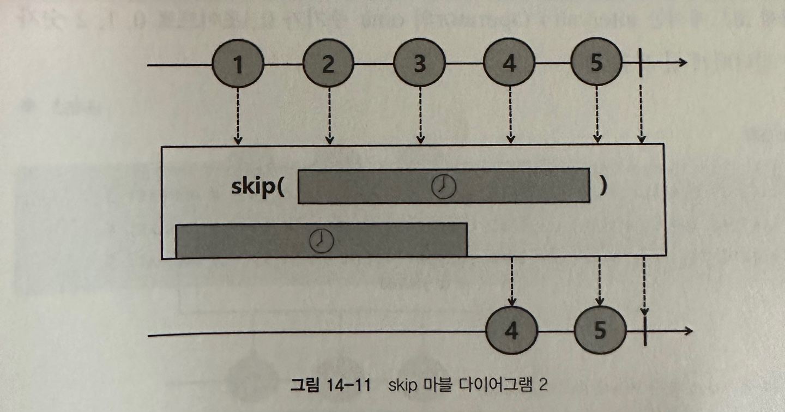

- skip 오퍼레이터의 파라미터로 시간도 지정 가능 

Example 14.19
~~~java
/**
 * skip 예제
 */
@Slf4j
public class Example14_19 {
    public static void main(String[] args) throws InterruptedException {
        Flux
            .interval(Duration.ofMillis(300))
            .skip(Duration.ofSeconds(1))
            .subscribe(data -> log.info("# onNext: {}", data));

        Thread.sleep(2000L);
    }
}
~~~

Example 14.20
~~~java
/**
 * skip 예제
 */
@Slf4j
public class Example14_20 {
    public static void main(String[] args) {
        Flux
            .fromIterable(SampleData.btcTopPricesPerYear)
            .filter(tuple -> tuple.getT2() >= 20_000_000)
            .skip(2)
            .subscribe(tuple -> log.info("{}, {}", tuple.getT1(), tuple.getT2()));
    }
}
~~~

#### take
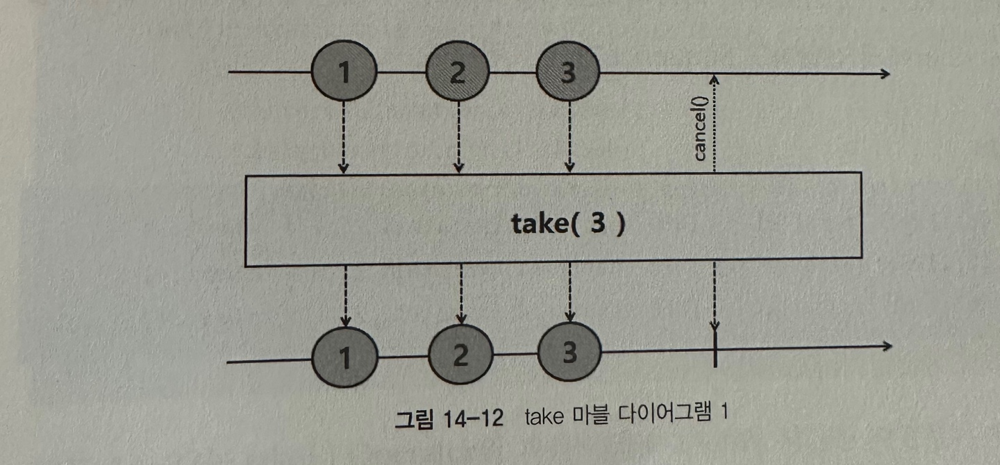

- Upstream 에서 emit 되는 데이터 중에서 파라미터로 입력받은 숫자만큼만 다운스트림으로 emit 

Example 14.21
~~~java
/**
 * take 예제
 */
@Slf4j
public class Example14_21 {
    public static void main(String[] args) throws InterruptedException {
        Flux
            .interval(Duration.ofSeconds(1))
            .take(3)
            .subscribe(data -> log.info("# onNext: {}", data));

        Thread.sleep(4000L);
    }
}
~~~

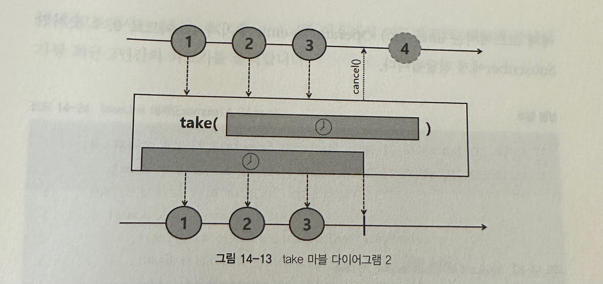

- take 오퍼레이터의 파라미터로 시간도 지정 가능 

Example 14.22
~~~java
/**
 * take 예제
 */
@Slf4j
public class Example14_22 {
    public static void main(String[] args) throws InterruptedException {
        Flux
            .interval(Duration.ofSeconds(1))
            .take(Duration.ofMillis(2500))
            .subscribe(data -> log.info("# onNext: {}", data));

        Thread.sleep(3000L);
    }
}
~~~

Example 14.23
~~~java
/**
 * takeLast 예제
 */
@Slf4j
public class Example14_23 {
    public static void main(String[] args) {
        Flux
            .fromIterable(SampleData.btcTopPricesPerYear)
            .takeLast(2)
            .subscribe(tuple -> log.info("# onNext: {}, {}",
                                            tuple.getT1(), tuple.getT2()));
    }
}
~~~
- take 오퍼레이터의 확장인 takeLast 오퍼레이터는 Upstream 에서 emit 된 데이터 중에서 파라미터 개수만큼 가장 마지막에 emit 된 데이터를 다운스트림으로 emit 

Example 14.24
~~~java
/**
 * takeUntil 예제
 */
@Slf4j
public class Example14_24 {
    public static void main(String[] args) {
        Flux
            .fromIterable(SampleData.btcTopPricesPerYear)
            .takeUntil(tuple -> tuple.getT2() > 20_000_000)
            .subscribe(tuple -> log.info("# onNext: {}, {}",
                                            tuple.getT1(), tuple.getT2()));
    }
}
~~~

- takeUntil 오퍼레이터는 파라미터로 입력한 람다식이 true 가 될때까지 emit
- Upstream 에서 emit된 데이터에는 Predicate 평가할 때 시용한 데이터가 포함된다는 사실을 기억할것

Example 14.25
~~~java
/**
 * takeWhile 예제
 */
@Slf4j
public class Example14_25 {
    public static void main(String[] args) {
        Flux
            .fromIterable(SampleData.btcTopPricesPerYear)
            .takeWhile(tuple -> tuple.getT2() < 20_000_000)
            .subscribe(tuple -> log.info("# onNext: {}, {}",
                                                tuple.getT1(), tuple.getT2()));
    }
}
~~~

- takeWhile 오퍼레이터는 람단 표현식이 true 가 되는 동안에만 emit 
- takeWhile 오퍼레이터는 takeUntil 과 다르게 Predicate 평가시 사용한 데이터는 다운스트림으로 emit 되지 않음

#### next
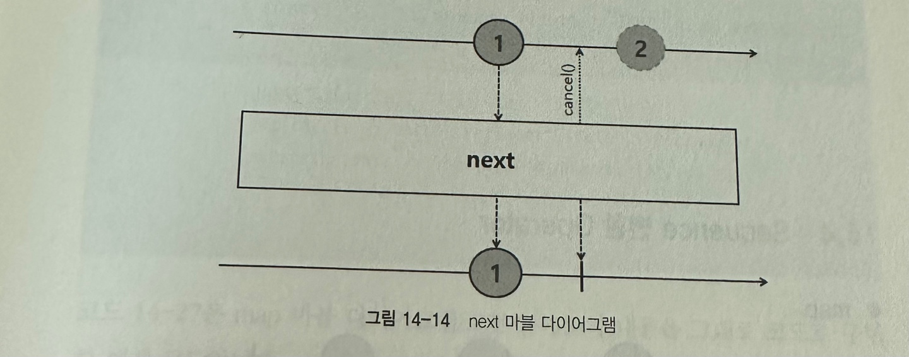

- next 는 업스트림에서 emit 되는 데이터 중에서 첫번째 데이터만 다운스트림으로 emit 
- 업스트림에서 emit 되는 데이터가 empty 라면 다운스트림으로 empty Mono 를 emit

Example 14.26
~~~java
/**
 * next 예제
 */
@Slf4j
public class Example14_26 {
    public static void main(String[] args) {
        Flux
            .fromIterable(SampleData.btcTopPricesPerYear)
            .next()
            .subscribe(tuple -> log.info("# onNext: {}, {}", tuple.getT1(), tuple.getT2()));
    }
}
~~~

### 14.4 Sequence 변환 Operator 

#### map 
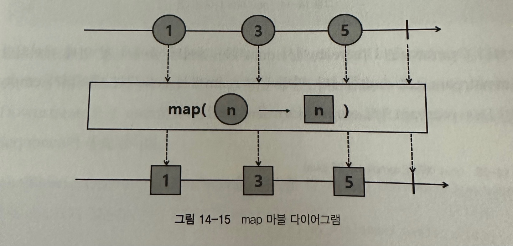

- map 은 업스트림에서 emit 된 데이터를 변환하고 다운스트림으로 emit

Example 14.27
~~~java
/**
 * map 예제
 */
@Slf4j
public class Example14_27 {
    public static void main(String[] args) {
        Flux
            .just("1-Circle", "3-Circle", "5-Circle")
            .map(circle -> circle.replace("Circle", "Rectangle"))
            .subscribe(data -> log.info("# onNext: {}", data));
    }
}
~~~

Example 14.28
~~~java
/**
 * map 예제
 */
@Slf4j
public class Example14_28 {
    public static void main(String[] args) {
        final double buyPrice = 50_000_000;
        Flux
                .fromIterable(SampleData.btcTopPricesPerYear)
                .filter(tuple -> tuple.getT1() == 2021)
                .doOnNext(data -> log.info("# doOnNext: {}", data))
                .map(tuple -> calculateProfitRate(buyPrice, tuple.getT2()))
                .subscribe(data -> log.info("# onNext: {}%", data));
    }

    private static double calculateProfitRate(final double buyPrice, Long topPrice) {
        return (topPrice - buyPrice) / buyPrice * 100;
    }
}
~~~

#### flatMap
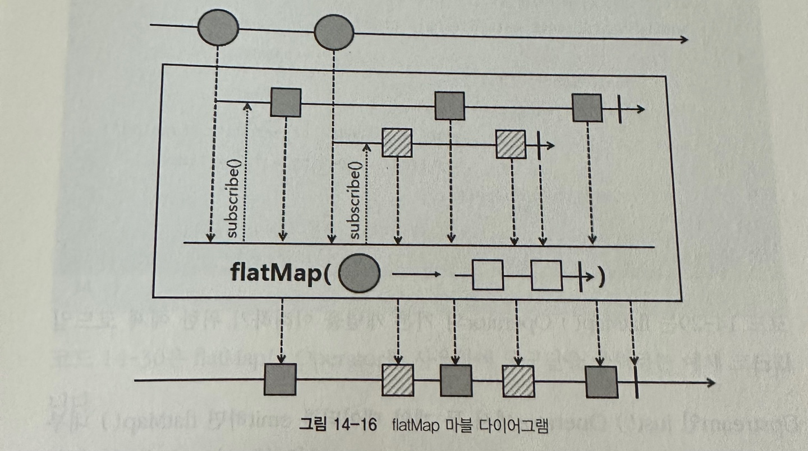

- 다중 겹의 시퀀스를 flatten(평탄화) 시키는 오퍼레이터

Example 14.29
~~~java
/**
 * flatMap 예제
 */
@Slf4j
public class Example14_29 {
    public static void main(String[] args) {
        Flux
            .just("Good", "Bad")
            .flatMap(feeling -> Flux
                                    .just("Morning", "Afternoon", "Evening")
                                    .map(time -> feeling + " " + time))
            .subscribe(log::info);
    }
}
~~~

Example 14.30
~~~java
/**
 * flatMap 예제
 */
@Slf4j
public class Example14_30 {
    public static void main(String[] args) throws InterruptedException {
        Flux
            .range(2, 8)
            .flatMap(dan -> Flux
                                .range(1, 9)
                                .publishOn(Schedulers.parallel())
                                .map(n -> dan + " * " + n + " = " + dan * n))
            .subscribe(log::info);

        Thread.sleep(100L);
    }
}
~~~

#### concat
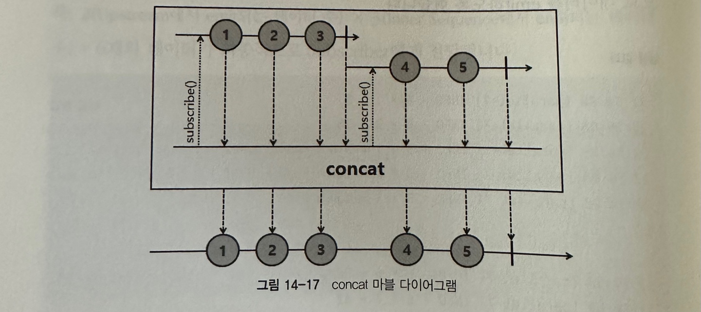

- 파라미터로 입력되는 퍼블리셔의 시퀀스를 연결해서 데이터를 순차적으로 emit
- 먼저 입력된 퍼블리셔의 시퀀스가 종료될 때 까지 나머지 퍼블리셔의 시퀀스는 구독되지 않고 대기합니다.

Example 14.31
~~~java
/**
 * concat 예제
 */
@Slf4j
public class Example14_31 {
    public static void main(String[] args) {
        Flux
            .concat(Flux.just(1, 2, 3), Flux.just(4, 5))
            .subscribe(data -> log.info("# onNext: {}", data));
    }
}
~~~

Example 14.32
~~~java
/**
 * concat 예제
 */
@Slf4j
public class Example14_32 {
    public static void main(String[] args) {
        Flux
                .concat(
                        Flux.fromIterable(getViralVector()),
                        Flux.fromIterable(getMRNA()),
                        Flux.fromIterable(getSubunit()))
                .subscribe(data -> log.info("# onNext: {}", data));
    }

    private static List<Tuple2<SampleData.CovidVaccine, Integer>> getViralVector() {
        return SampleData.viralVectorVaccines;
    }

    private static List<Tuple2<SampleData.CovidVaccine, Integer>> getMRNA() {
        return SampleData.mRNAVaccines;
    }

    private static List<Tuple2<SampleData.CovidVaccine, Integer>> getSubunit() {
        return SampleData.subunitVaccines;
    }
}
~~~

#### merge
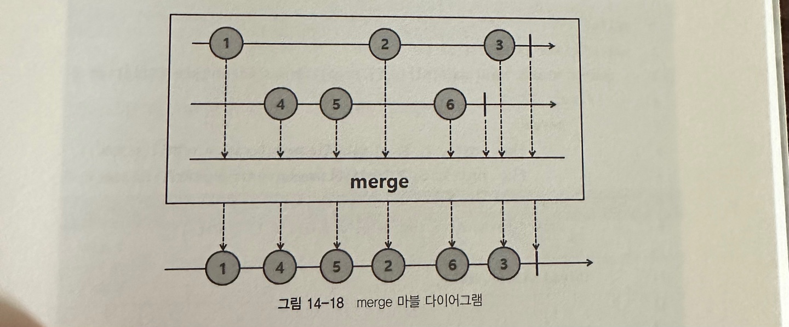

- merge 는 파라미터로 입력되는 퍼블리셔의 시퀀스에서 emit 된 데이터를 인터리빙 방식으로 병합
- concat 과는 달리 뒤 시퀀스가 앞 시퀀스를 기다리지 않고 즉시 subscribe 됨

Example 14.33
~~~java
/**
 * merge 예제
 */
@Slf4j
public class Example14_33 {
    public static void main(String[] args) throws InterruptedException {
        Flux
            .merge(
                    Flux.just(1, 2, 3, 4).delayElements(Duration.ofMillis(300L)),
                    Flux.just(5, 6, 7).delayElements(Duration.ofMillis(500L))
            )
            .subscribe(data -> log.info("# onNext: {}", data));

        Thread.sleep(2000L);
    }
}
~~~

Example 14.34
~~~java
/**
 * merge 예제
 */
@Slf4j
public class Example14_34 {
    public static void main(String[] args) throws InterruptedException {
        String[] usaStates = {
                "Ohio", "Michigan", "New Jersey", "Illinois", "New Hampshire",
                "Virginia", "Vermont", "North Carolina", "Ontario", "Georgia"
        };

        Flux
                .merge(getMeltDownRecoveryMessage(usaStates))
                .subscribe(log::info);

        Thread.sleep(2000L);
    }

    private static List<Mono<String>> getMeltDownRecoveryMessage(String[] usaStates) {
        List<Mono<String>> messages = new ArrayList<>();
        for (String state : usaStates) {
            messages.add(SampleData.nppMap.get(state));
        }

        return messages;
    }
}
~~~

#### zip
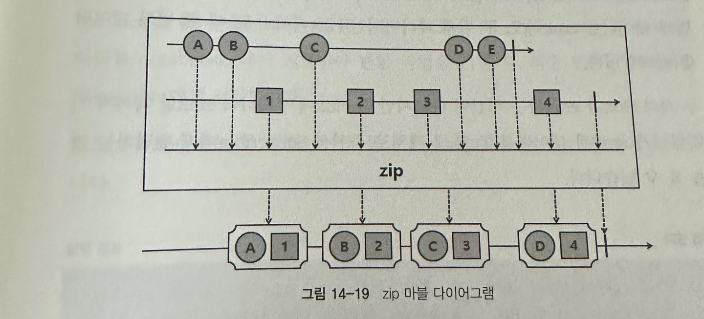

- zip 오퍼레이터는 파라미터로 입력되는 시퀀스 emit 된 데이터를 결합
- 각 publisher 가 데이터를 하나씩 emit 할때까지 기다렸다가 결합

Example 14.35
~~~java
/**
 * zip 예제
 */
@Slf4j
public class Example14_35 {
    public static void main(String[] args) throws InterruptedException {
        Flux
            .zip(
                    Flux.just(1, 2, 3).delayElements(Duration.ofMillis(300L)),
                    Flux.just(4, 5, 6).delayElements(Duration.ofMillis(500L))
            )
            .subscribe(tuple2 -> log.info("# onNext: {}", tuple2));

        Thread.sleep(2500L);
    }
}
~~~

Example 14.36
~~~java
/**
 * zip 예제
 */
@Slf4j
public class Example14_36 {
    public static void main(String[] args) throws InterruptedException {
        Flux
            .zip(
                    Flux.just(1, 2, 3).delayElements(Duration.ofMillis(300L)),
                    Flux.just(4, 5, 6).delayElements(Duration.ofMillis(500L)),
                    (n1, n2) -> n1 * n2
            )
            .subscribe(data -> log.info("# onNext: {}", data));

        Thread.sleep(2500L);
    }
}
~~~

Example 14.37
~~~java
/**
 * zip 예제
 */
@Slf4j
public class Example14_37 {
    public static void main(String[] args) throws InterruptedException {
        getInfectedPersonsPerHour(10, 21)
                .subscribe(tuples -> {
                    Tuple3<Tuple2, Tuple2, Tuple2> t3 = (Tuple3) tuples;
                    int sum = (int) t3.getT1().getT2() +
                            (int) t3.getT2().getT2() + (int) t3.getT3().getT2();
                    log.info("# onNext: {}, {}", t3.getT1().getT1(), sum);
                });
    }

    private static Flux getInfectedPersonsPerHour(int start, int end) {
        return Flux.zip(
                Flux.fromIterable(SampleData.seoulInfected)
                        .filter(t2 -> t2.getT1() >= start && t2.getT1() <= end),
                Flux.fromIterable(SampleData.incheonInfected)
                        .filter(t2 -> t2.getT1() >= start && t2.getT1() <= end),
                Flux.fromIterable(SampleData.suwonInfected)
                        .filter(t2 -> t2.getT1() >= start && t2.getT1() <= end)
        );
    }
}
~~~

#### and
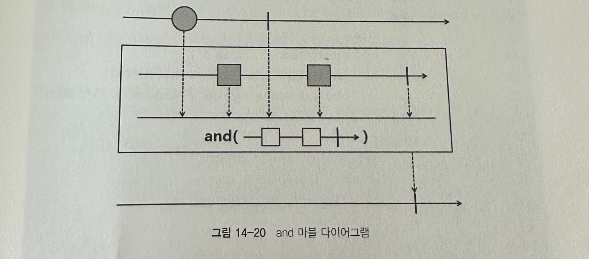

- and Operator 은 Mono 의 complete 시그널과 파라미터로 입력된 퍼블리셔의 complete 시그널을 결합하여 새로운 Mono 를 반환

Example 14.38
~~~java
/**
 * and 예제
 */
@Slf4j
public class Example14_38 {
    public static void main(String[] args) throws InterruptedException {
        Mono
                .just("Task 1")
                .delayElement(Duration.ofSeconds(1))
                .doOnNext(data -> log.info("# Mono doOnNext: {}", data))
                .and(
                        Flux
                                .just("Task 2", "Task 3")
                                .delayElements(Duration.ofMillis(600))
                                .doOnNext(data -> log.info("# Flux doOnNext: {}", data))
                )
                .subscribe(
                        data -> log.info("# onNext: {}", data),
                        error -> log.error("# onError:", error),
                        () -> log.info("# onComplete")
                );

        Thread.sleep(5000);
    }
}
~~~

- doOnNext 오퍼레이터를 사용하여 두개의 시퀀스에서 데이터가 emit 
- 그러나 최종적으로 Subscriber 에게는 onComplete 시그널만 전송 

Example 14.39
~~~java
/**
 * and 예제
 */
@Slf4j
public class Example14_39 {
    public static void main(String[] args) throws InterruptedException {
        restartApplicationServer()
                .and(restartDBServer())
                .subscribe(
                        data -> log.info("# onNext: {}", data),
                        error -> log.error("# onError:", error),
                        () -> log.info("# sent an email to Administrator: " +
                                "All Servers are restarted successfully")
                );

        Thread.sleep(6000L);
    }

    private static Mono<String> restartApplicationServer() {
        return Mono
                .just("Application Server was restarted successfully.")
                .delayElement(Duration.ofSeconds(2))
                .doOnNext(log::info);
    }

    private static Publisher<String> restartDBServer() {
        return Mono
                .just("DB Server was restarted successfully.")
                .delayElement(Duration.ofSeconds(4))
                .doOnNext(log::info);
    }
}
~~~

- and 오퍼레이터는 모든 작업이 끝난 시점에 최종적으로 후처리 작업을 수행하기 적합한 Operator 

#### collectList
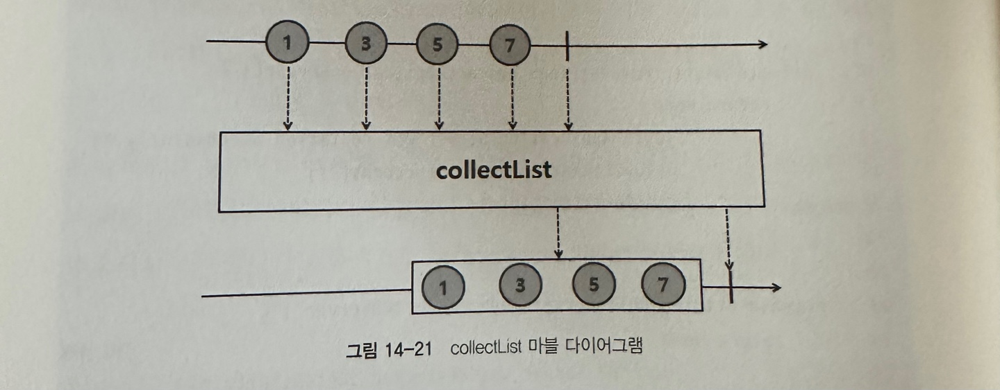

- collectList Operator 은 Flux 에서 emit 된 데이터를 모아서 리스트로 변환
- 변환된 리스트를 emit 하는 Mono 를 반환 

Example 14.40
~~~java
/**
 * collectList 예제
 */
@Slf4j
public class Example14_40 {
    public static void main(String[] args) {
        Flux
            .just("...", "---", "...")
            .map(code -> transformMorseCode(code))
            .collectList()
            .subscribe(list -> log.info(list.stream().collect(Collectors.joining())));
    }

    public static String transformMorseCode(String morseCode) {
        return SampleData.morseCodeMap.get(morseCode);
    }
}
~~~

#### collectMap
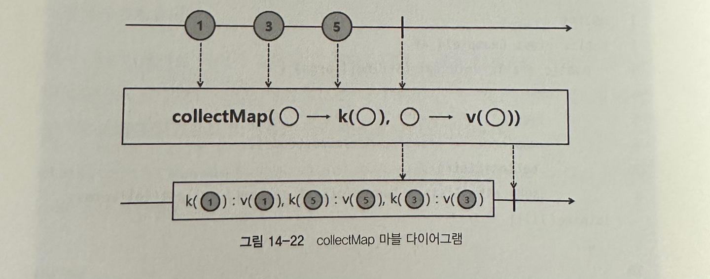

- collectMap Operator 은 Flux 에서 emit 된 데이터를 기반으로 key value 를 생성하여 최종적으로 Map 를 emit 하는 Mono 를 반환

Example 14.41
~~~java
/**
 * collectMap 예제
 */
@Slf4j
public class Example14_41 {
    public static void main(String[] args) {
        Flux
            .range(0, 26)
            .collectMap(key -> SampleData.morseCodes[key],
                    value -> transformToLetter(value))
            .subscribe(map -> log.info("# onNext: {}", map));
    }

    private static String transformToLetter(int value) {
        return Character.toString((char) ('a' + value));
    }
}
~~~

### 14.5 Sequence 의 내부 동작 확인을 위한 Operator
- emit 되는 데이터의 변경 없이 부수 효과만을 수행하기 위한 Operator 
- 로그를 출력하는 등 디버깅 용도로 많이 사용
- emit 과정에서 error 가 발생하면 해당 에러에 대한 알림 전송
- doOnXXXX()

#### doOnXXXX() Operator 목록 
1. doOnSubscribe  
Publisher가 구독 중일 때 트리거되는 동작을 추가할 수 있음

2. doOnRequest  
Publisher 가 요청을 수신할 때 트리거되는 동작을 추가할 수 있음

3. doOnNext  
Publisher 가 데이터를 emit 할 때 트리거되는 동작을 추가할 수 있음

4. doOnComplete  
Publisher 가 성공적으로 완료되었을때 트리거되는 동작을 추가할 수 있음

5. doOnError  
Publisher 가 에러가 발생한 상태로 종료되었을 때 트리거되는 동작 추가할 수 있음

6. doOnCancel  
Publisher 가 취소되었을 때 트리거되는 동작을 추가할 수 있다

7. doOnTerminate  
Publisher 가 성공적으로 완료되었을 때 또는 에러가 발생한 상태로 종료되었을때 트리거되는 공작을 추가할 수 있다

8. doOnEach  
Publisher 가 데이터를 emit 할 때 성공적으로 완료되었을 때 에러가 발생한 상태가 종료되었을 때 트리거되는 동작을 추가할 수 있다.

9. doOnDiscard  
Upstream 에 있는 전체 Operator 체인의 동작 중에서 오퍼레이터에 의해 폐기되는 요소를 조건부로 정리할 수 있다.

10. doAfterTerminate  
DownStream 을 성공적으로 완료한 직후 또는 에러가 발생하여 퍼블리셔가 종료된 직후에 트리거되는 동작을 추가할 수 있다.

11. doFirst  
Publisher 가 구독되기 전에 트리거되는 동작을 추가할 수 있다.

12. doFinally  
에러를 포함해서 어떤 이유이든 간에 퍼블리셔가 종료된 후 트리거되는 동작을 추가할 수 있다.

### 14.6 에러 처리를 위한 오퍼레이터 

#### error 
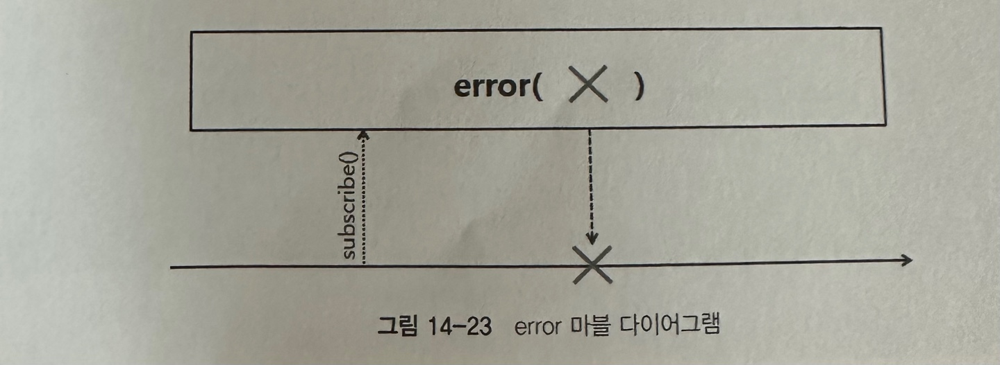

- error 오퍼레이터는 파라미터로 지정된 에러로 종료하는 Flux 생성
- 마치 java 의 Throw 키워드를 사용하여 예외를 의도적으로 던지는 것 같은 역할

Example 14.43
~~~java
/**
 * error 처리 예제
 *  - error Operator
 *      - 명시적으로 error 이벤트를 발생시켜야 하는 경우
 */
@Slf4j
public class Example14_43 {
    public static void main(String[] args) {
        Flux
            .range(1, 5)
            .flatMap(num -> {
                if ((num * 2) % 3 == 0) {
                    return Flux.error(
                            new IllegalArgumentException("Not allowed multiple of 3"));
                } else {
                    return Mono.just(num * 2);
                }
            })
            .subscribe(data -> log.info("# onNext: {}", data),
                    error -> log.error("# onError: ", error));
    }
}
~~~

Example 14.44
~~~java
/**
 * error 처리 예제
 *  - error Operator
 *      - 명시적으로 error 이벤트를 발생시켜야 하는 경우
 *      - flatMap처럼 Inner Sequence가 존재하는 경우 체크 예외 발생 시 Flux로 래핑해서 onError Signal을 전송할 수 있다.
 */
@Slf4j
public class Example14_44 {
    public static void main(String[] args) {
        Flux
            .just('a', 'b', 'c', '3', 'd')
            .flatMap(letter -> {
                try {
                    return convert(letter);
                } catch (DataFormatException e) {
                    return Flux.error(e);
                }
            })
            .subscribe(data -> log.info("# onNext: {}", data),
                    error -> log.error("# onError: ", error));
    }

    private static Mono<String> convert(char ch) throws DataFormatException {
        if (!Character.isAlphabetic(ch)) {
            throw new DataFormatException("Not Alphabetic");
        }
        return Mono.just("Converted to " + Character.toUpperCase(ch));
    }
}
~~~

#### onErrorReturn
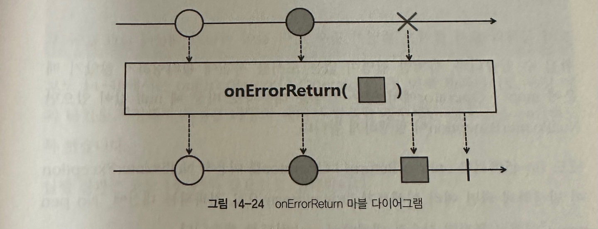

- onErrorReturn 오퍼레이터는 에러 이벤트가 발생했을 때, 에러 이벤트를 다운스트림으로 전파하지 않고 대체 값 emit 

Example 14.45
~~~java
/**
 * error 처리 예제
 *  - onErrorReturn Operator
 *      - 예외가 발생했을 때, error 이벤트를 발생시키지 않고, default value로 대체해서 emit하고자 할 경우
 *      - try ~ catch 문의 경우, catch해서 return default value 하는 것과 같다.
 */
@Slf4j
public class Example14_45 {
    public static void main(String[] args) {
        getBooks()
                .map(book -> book.getPenName().toUpperCase())
                .onErrorReturn("No pen name")
                .subscribe(log::info);
    }

    public static Flux<Book> getBooks() {
        return Flux.fromIterable(SampleData.books);
    }
}
~~~

Example 14.46
~~~java
/**
 * error 처리 예제
 *  - onErrorReturn Operator
 *      - 예외가 발생했을 때, error 이벤트를 발생시키지 않고, default value로 대체해서 emit하고자 할 경우
 *      - try ~ catch 문의 경우, catch해서 return default value 하는 것과 같다.
 */
@Slf4j
public class Example14_46 {
    public static void main(String[] args) {
        getBooks()
                .map(book -> book.getPenName().toUpperCase())
                .onErrorReturn(NullPointerException.class, "no pen name")
                .onErrorReturn(IllegalFormatException.class, "Illegal pen name")
                .subscribe(log::info);
    }

    public static Flux<Book> getBooks() {
        return Flux.fromIterable(SampleData.books);
    }
}
~~~

#### onErrorReturn
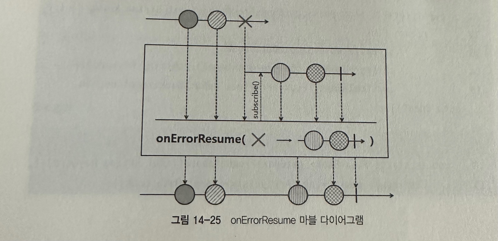

- 에러 이벤트가 발생했을 때, 에러 이벤트를 전파하지 않고 대체 퍼블리셔 리턴
- try catch 와 비슷

Example 14.47
~~~java
/**
 * error 처리 예제
 *  - onErrorResume Operator
 *      - 예외가 발생했을 때, error 이벤트를 발생시키지 않고, 대체 Publisher로 데이터를 emit하고자 할 경우
 *      - try ~ catch 문의 경우, catch해서 return default value 하는 것과 같다.
 */
@Slf4j
public class Example14_47 {
    public static void main(String[] args) {
        final String keyword = "DDD";
        getBooksFromCache(keyword)
                .onErrorResume(error -> getBooksFromDatabase(keyword))
                .subscribe(data -> log.info("# onNext: {}", data.getBookName()),
                        error -> log.error("# onError: ", error));
    }

    public static Flux<Book> getBooksFromCache(final String keyword) {
        return Flux
                .fromIterable(SampleData.books)
                .filter(book -> book.getBookName().contains(keyword))
                .switchIfEmpty(Flux.error(new NoSuchBookException("No such Book")));
    }

    public static Flux<Book> getBooksFromDatabase(final String keyword) {
        List<Book> books = new ArrayList<>(SampleData.books);
        books.add(new Book("DDD: Domain Driven Design",
                "Joy", "ddd-man", 35000, 200));
        return Flux
                .fromIterable(books)
                .filter(book -> book.getBookName().contains(keyword))
                .switchIfEmpty(Flux.error(new NoSuchBookException("No such Book")));
    }

    private static class NoSuchBookException extends RuntimeException {
        NoSuchBookException(String message) {
            super(message);
        }
    }
}
~~~

#### onErrorContinue
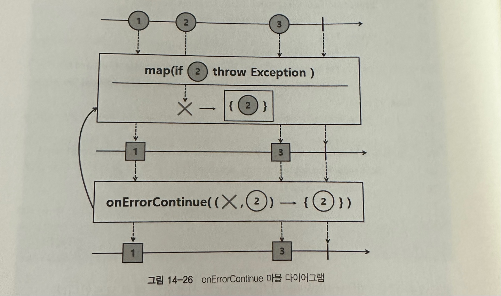

- Sequence 기 종료되지 않고 아직 emit 되지 않은 데이터를 다시 emit 해야 할 때 사용
- 에러가 발생했을 때, 에러 영역 내에 있는 데이터는 제거하고 upstream 에서 후속 데이터를 emit 하는 방식으로 에러를 복구할 수 있도록 해줌 

Example 14.48
~~~java
/**
 * error 처리 예제
 *  - onErrorContinue Operator
 *      - 예외가 발생했을 때, 예외를 발생시킨 데이터를 건너뛰고 Upstream에서 emit된 다음 데이터를
 *        처리한다.
 */
@Slf4j
public class Example14_48 {
    public static void main(String[] args) {
        Flux
            .just(1, 2, 4, 0, 6, 12)
            .map(num -> 12 / num)
            .onErrorContinue((error, num) ->
                    log.error("error: {}, num: {}", error, num))
            .subscribe(data -> log.info("# onNext: {}", data),
                        error -> log.error("# onError: ", error));
    }
}
~~~

- emit 된 숫자 중 네번째 숫자가 0이라 예외가 발생할 것 
- 그러나 onErrorContinue operator 로 인해 나머지 숫자들 다시 emit 시작

#### retry
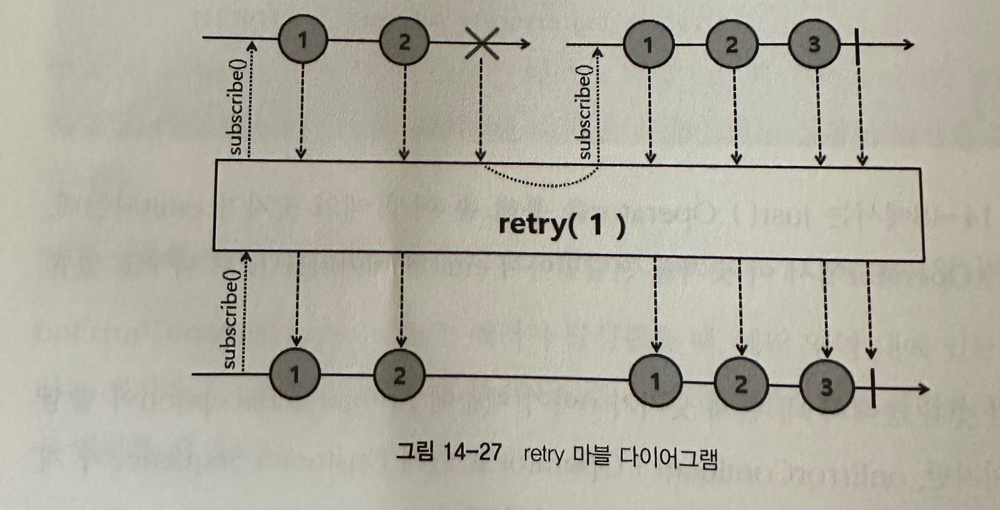

- 퍼블리셔가 데이터를 방출하는 과정에서 에러가 발생하면, 파라미터로 입력한 횟수만큼 원본 Flux 의 Sequence 를 다시 구독 
- 무한 반복도 가능 

Example 14.49
~~~java
/**
 * error 처리 예제
 *  - retry Operator
 *      - 에러가 발생했을 때, 지정된 횟수만큼 Sequence를 다시 구독한다.
 */
@Slf4j
public class Example14_49 {
    public static void main(String[] args) throws InterruptedException {
        final int[] count = {1};
        Flux
            .range(1, 3)
            .delayElements(Duration.ofSeconds(1))
            .map(num -> {
                try {
                    if (num == 3 && count[0] == 1) {
                        count[0]++;
                        Thread.sleep(1000);
                    }
                } catch (InterruptedException e) {}

                return num;
            })
            .timeout(Duration.ofMillis(1500))
            .retry(1)
            .subscribe(data -> log.info("# onNext: {}", data),
                    (error -> log.error("# onError: ", error)),
                    () -> log.info("# onComplete"));

        Thread.sleep(7000);
    }
}
~~~
- 1회 재구독 하는 예제 

Example 14.50
~~~java
/**
 * error 처리 예제
 *  - retry Operator
 *      - 에러가 발생했을 때, 지정된 횟수만큼 Sequence를 다시 구독한다.
 */
@Slf4j
public class Example14_50 {
    public static void main(String[] args) throws InterruptedException {
        getBooks()
                .collect(Collectors.toSet())
                .subscribe(bookSet -> bookSet.stream()
                        .forEach(book -> log.info("book name: {}, price: {}",
                                book.getBookName(), book.getPrice())));

        Thread.sleep(12000);
    }

    private static Flux<Book> getBooks() {
        final int[] count = {0};
        return Flux
                .fromIterable(SampleData.books)
                .delayElements(Duration.ofMillis(500))
                .map(book -> {
                    try {
                        count[0]++;
                        if (count[0] == 3) {
                            Thread.sleep(2000);
                        }
                    } catch (InterruptedException e) {
                    }

                    return book;
                })
                .timeout(Duration.ofSeconds(2))
                .retry(1)
                .doOnNext(book -> log.info("# getBooks > doOnNext: {}, price: {}",
                        book.getBookName(), book.getPrice()));
    }
}
~~~
- 1회 재구독 하는 예제 

### 14.7 Sequence 의 동작시간 측정을 위한 Operator 

- 동작 시간 제어 이외에도 동작 시간 자체를 측정하는 특별한 operator 존재

#### elapsed
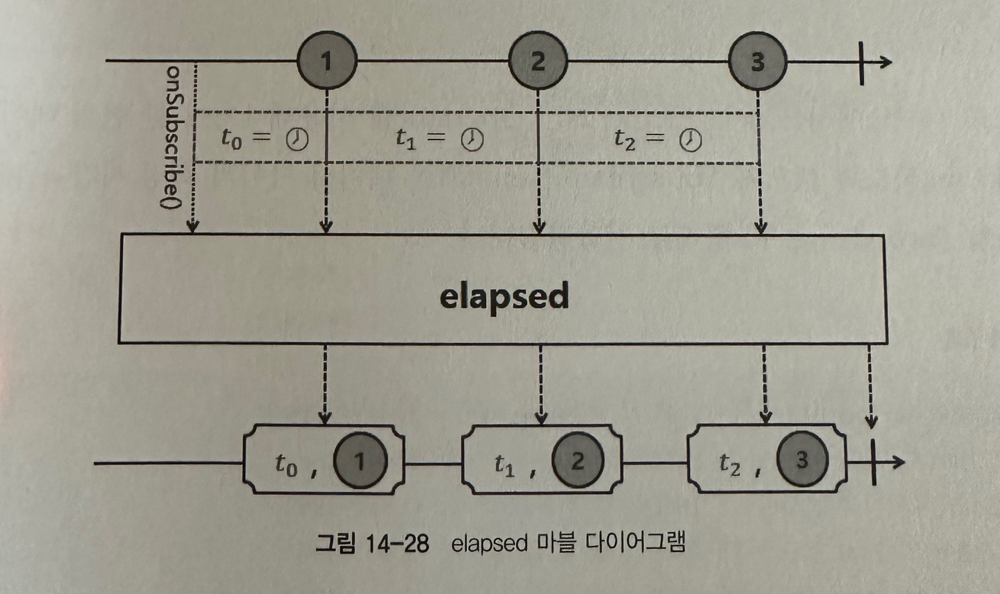

- emit 된 데이터 사이의 경과 시간을 측정하여 튜플 형태로 emit 
- 첫 번째 데이터는 onSubscribe 시그널과 첫번째 데이터 사이를 기준으로 측정

Example 14.51
~~~java
/**
 * 시간 측정 예제
 *  - elapsed Operator
 *      - emit된 데이터 사이의 경과된 시간을 측정한다.
 *      - emit된 첫번째 데이터는 onSubscribe Signal과 첫번째 데이터 사이의 시간을 기준으로 측정한다.
 *      - 측정된 시간 단위는 milliseconds이다.
 */
@Slf4j
public class Example14_51 {
    public static void main(String[] args) throws InterruptedException {
        Flux
            .range(1, 5)
            .delayElements(Duration.ofSeconds(1))
            .elapsed()
            .subscribe(data -> log.info("# onNext: {}, time: {}",
                                                data.getT2(), data.getT1()));

        Thread.sleep(6000);
    }
}
~~~

Example 14.52
~~~java
/**
 * 시간 측정 예제
 *  - elapsed Operator
 *      - emit된 데이터 사이의 경과된 시간을 측정한다.
 *      - emit된 첫번째 데이터는 onSubscribe Signal과 첫번째 데이터 사이의 시간을 기준으로 측정한다.
 *      - 측정된 시간 단위는 milliseconds이다.
 */
@Slf4j
public class Example14_52 {
    public static void main(String[] args) {
        URI worldTimeUri = UriComponentsBuilder.newInstance().scheme("http")
                .host("worldtimeapi.org")
                .port(80)
                .path("/api/timezone/Asia/Seoul")
                .build()
                .encode()
                .toUri();

        RestTemplate restTemplate = new RestTemplate();
        HttpHeaders headers = new HttpHeaders();
        headers.setAccept(Collections.singletonList(MediaType.APPLICATION_JSON));

        Mono.defer(() -> Mono.just(
                            restTemplate
                                    .exchange(worldTimeUri,
                                            HttpMethod.GET,
                                            new HttpEntity<String>(headers),
                                            String.class)
                        )
                )
                .repeat(4)
                .elapsed()
                .map(response -> {
                    DocumentContext jsonContext =
                            JsonPath.parse(response.getT2().getBody());
                    String dateTime = jsonContext.read("$.datetime");
                    return Tuples.of(dateTime, response.getT1());
                })
                .subscribe(
                        data -> log.info("now: {}, elapsed time: {}", data.getT1(), data.getT2()),
                        error -> log.error("# onError:", error),
                        () -> log.info("# onComplete")
                );
    }
}
~~~

### 14.8 Flux Sequence 분할을 위한 Operator

#### window 
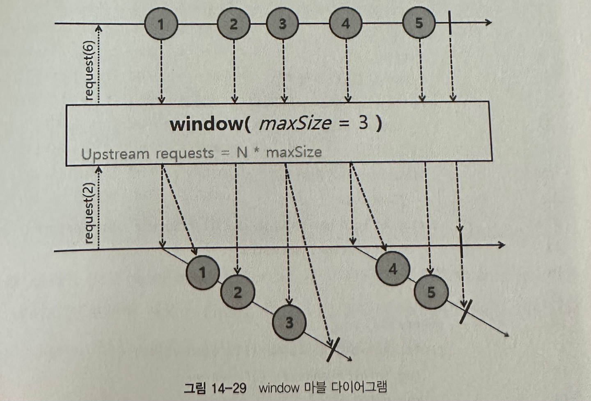

- 업스트림에서 emit 되는 첫번째 데이터부터 maxSize 숫자만큼의 데이터를 포함하는 새로운 Flux 로 분할 (분할된 것을 Window 라 부름)

Example 14.53
~~~java
/**
 * split 예제
 *  - window(maxSize) Operator
 *      - Upstream에서 emit되는 첫 번째 데이터부터 maxSize의 숫자만큼의 데이터를 포함하는 새로운 Flux로 분할한다.
 *      - 새롭게 생성되는 Flux를 윈도우(Window)라고 한다.
 *      - 마지막 윈도우가 포함하는 데이터는 maxSize보다 작거나 같다.
 */
@Slf4j
public class Example14_53 {
    public static void main(String[] args) {
        Flux.range(1, 11)
                .window(3)
                .flatMap(flux -> {
                    log.info("======================");
                    return flux;
                })
                .subscribe(new BaseSubscriber<>() {
                    @Override
                    protected void hookOnSubscribe(Subscription subscription) {
                        subscription.request(2);
                    }

                    @Override
                    protected void hookOnNext(Integer value) {
                        log.info("# onNext: {}", value);
                        request(2);
                    }
                });
    }
}
~~~

Example 14.54
~~~java
/**
 * split 예제
 *  - window(maxSize) Operator
 *      - Upstream에서 emit되는 첫 번째 데이터부터 maxSize의 숫자만큼의 데이터를 포함하는 새로운 Flux로 분할한다.
 *      - 새롭게 생성되는 Flux를 윈도우(Window)라고 한다.
 *      - 마지막 윈도우가 포함하는 데이터는 maxSize보다 작거나 같다.
 */
@Slf4j
public class Example14_54 {
    public static void main(String[] args) {
        Flux.fromIterable(SampleData.monthlyBookSales2021)
                .window(3)
                .flatMap(flux -> MathFlux.sumInt(flux))
                .subscribe(new BaseSubscriber<>() {
                    @Override
                    protected void hookOnSubscribe(Subscription subscription) {
                        subscription.request(2);
                    }

                    @Override
                    protected void hookOnNext(Integer value) {
                        log.info("# onNext: {}", value);
                        request(2);
                    }
                });
    }
}
~~~

#### buffer 
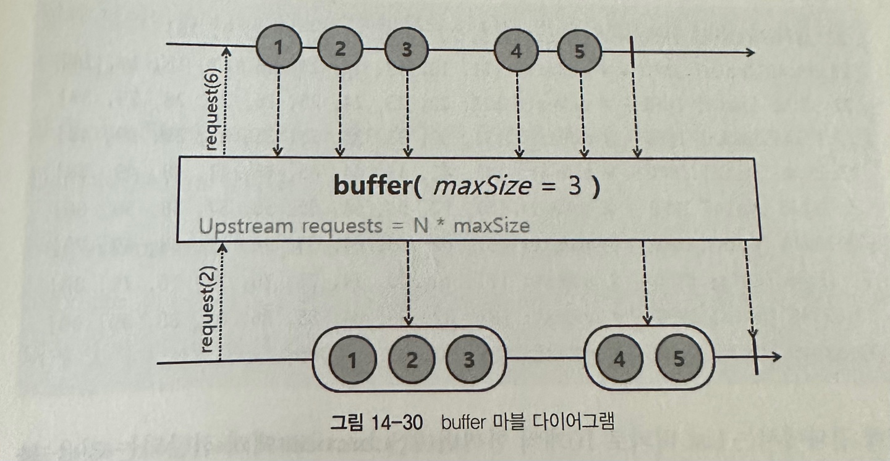

- 업스트림에서 emit 되는 첫 번째 데이터부터 maxSize 숫자만큼의 데이터를 List 버퍼로 한번에 emit 

Example 14.55
~~~java
/**
 * split 예제
 *  - buffer(maxSize) Operator
 *      - Upstream에서 emit되는 첫 번째 데이터부터 maxSize 숫자만큼의 데이터를 List 버퍼로 한번에 emit한다.
 *      - 마지막 버퍼가 포함하는 데이터는 maxSize보다 작거나 같다.
 */
@Slf4j
public class Example14_55 {
    public static void main(String[] args) {
        Flux.range(1, 95)
                .buffer(10)
                .subscribe(buffer -> log.info("# onNext: {}", buffer));
    }
}
~~~

- 버퍼 사이즈가 10개로 지정되어 있어, 10개가 버퍼에 담기면 List 버퍼 형태로 다운스트림에 emit 

#### bufferTimeout
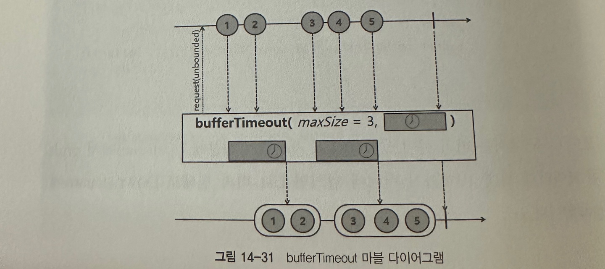

- 업스트림에서 emit 되는 첫 번째 데이터부터 maxSize 숫자만큼의 데이터를 maxSize 숫자만큼의 데이터 또는 maxTime 내에 emit 된 데이터를 List 버퍼로 한번에 emit 

Example 14.56
~~~java
/**
 * split 예제
 *  - bufferTimeout(maxSize, maxTime) Operator
 *      - Upstream에서 emit되는 첫 번째 데이터부터 maxSize 숫자 만큼의 데이터 또는 maxTime 내에 emit된 데이터를 List 버퍼로 한번에 emit한다.
 *      - maxSize나 maxTime에서 먼저 조건에 부합할때까지 emit된 데이터를 List 버퍼로 emit한다.
 *      - 마지막 버퍼가 포함하는 데이터는 maxSize보다 작거나 같다.
 */
@Slf4j
public class Example14_56 {
    public static void main(String[] args) {
        Flux
            .range(1, 20)
            .map(num -> {
                try {
                    if (num < 10) {
                        Thread.sleep(100L);
                    } else {
                        Thread.sleep(300L);
                    }
                } catch (InterruptedException e) {}
                return num;
            })
            .bufferTimeout(3, Duration.ofMillis(400L))
            .subscribe(buffer -> log.info("# onNext: {}", buffer));
    }
}
~~~

#### groupBy
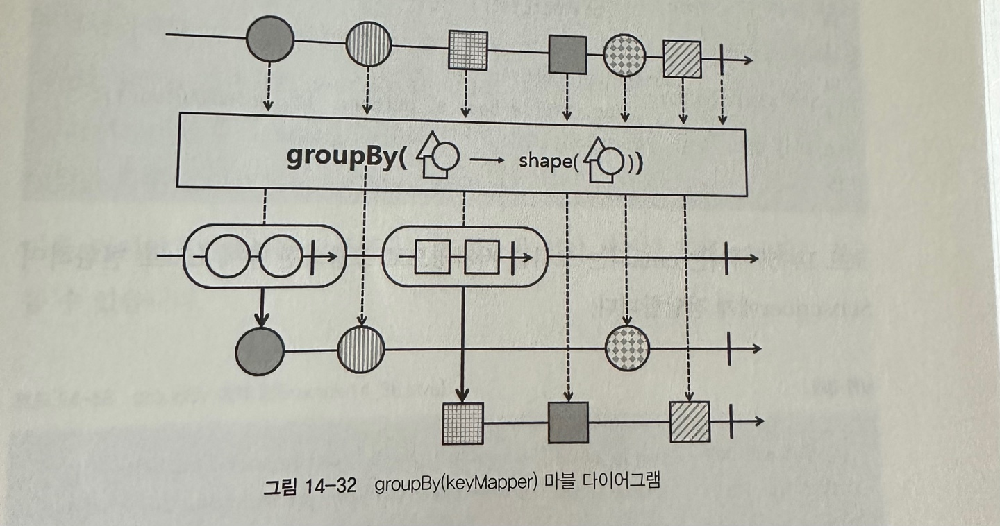

- emit 되는 데이터를 keyMapper 로 생성한 key 를 기준으로 그룹화한 GroupedFlux 를 리턴
- 이 GroupedFlux 를 통해 그룹별로 작업 수행가능

Example 14.57
~~~java
/**
 * split 예제
 *  - groupBy(keyMapper) Operator
 *      - emit되는 데이터를 key를 기준으로 그룹화 한 GroupedFlux를 리턴한다.
 *      - 그룹화 된 GroupedFlux로 그룹별 작업을 할 수 있다.
 */
@Slf4j
public class Example14_57 {
    public static void main(String[] args) {
        Flux.fromIterable(SampleData.books)
                .groupBy(book -> book.getAuthorName())
                .flatMap(groupedFlux ->
                        groupedFlux
                                .map(book -> book.getBookName() +
                                        "(" + book.getAuthorName() + ")")
                                .collectList()
                )
                .subscribe(bookByAuthor ->
                        log.info("# book by author: {}", bookByAuthor));
    }
}
~~~

- 아래 마블 다이어그램에서 확인 가능

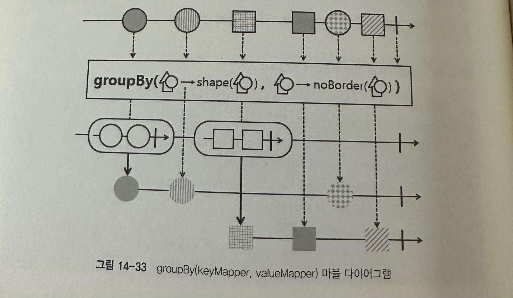

Example 14.58
~~~java
/**
 * split 예제
 *  - groupBy(keyMapper, valueMapper) Operator
 *      - emit되는 데이터를 key를 기준으로 그룹화 한 GroupedFlux를 리턴한다.
 *      - 그룹화 된 GroupedFlux로 그룹별 작업을 할 수 있다.
 *      - valueMapper를 추가로 전달해서 그룹화 되어 emit되는 데이터의 값을 미리 다른 값으로 변경할 수 있다.
 */
@Slf4j
public class Example14_58 {
    public static void main(String[] args) {
        Flux.fromIterable(SampleData.books)
                .groupBy(book ->
                        book.getAuthorName(),
                        book -> book.getBookName() + "(" + book.getAuthorName() + ")")
                .flatMap(groupedFlux -> groupedFlux.collectList())
                .subscribe(bookByAuthor ->
                        log.info("# book by author: {}", bookByAuthor));
    }
}
~~~

Example 14.59
~~~java
/**
 * split 예제
 *  - groupBy() Operator
 *      - emit되는 데이터를 key를 기준으로 그룹화 한 GroupedFlux를 리턴한다.
 *      - 그룹화 된 GroupedFlux로 그룹별 작업을 할 수 있다.
 *      - 저자 명으로 된 도서의 가격
 */
@Slf4j
public class Example14_59 {
    public static void main(String[] args) {
        Flux.fromIterable(SampleData.books)
                .groupBy(book -> book.getAuthorName())
                .flatMap(groupedFlux ->
                    Mono
                        .just(groupedFlux.key())
                        .zipWith(
                            groupedFlux
                                .map(book ->
                                    (int)(book.getPrice() * book.getStockQuantity() * 0.1))
                                .reduce((y1, y2) -> y1 + y2),
                                    (authorName, sumRoyalty) ->
                                        authorName + "'s royalty: " + sumRoyalty)
                )
                .subscribe(log::info);
    }
}
~~~

### 다수의 Subscriber 에게 Flux 를 멀티캐스팅 하기 위한 Operator 

Subscriber 가 구독을 하면 Upstream 에서 emit 된 데이터가 모든 구독자에게 멀티캐스팅 됨 

#### publish 
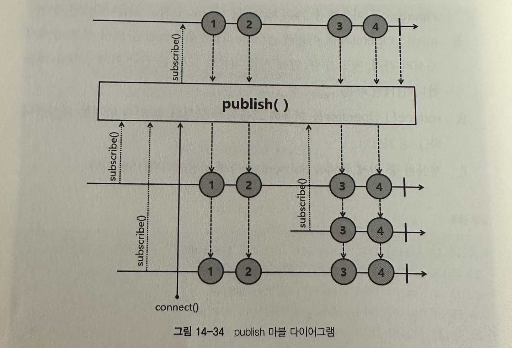

- publish 오퍼레이터는 구독을 하더라도 구독 시점에 즉시 데이터를 emit 하지 않고 connect() 를 호출하는 시점에 비로소 데이터를 emit 

Example 14.60
~~~java
/**
 * multicast 예제
 *  - publish() Operator
 *      - 다수의 Subscriber와 Flux를 공유한다.
 *      - 즉, Cold Sequence를 Hot Sequence로 변환한다.
 *      - connect()가 호출 되기 전까지는 데이터를 emit하지 않는다.
 */
@Slf4j
public class Example14_60 {
    public static void main(String[] args) throws InterruptedException {
        ConnectableFlux<Integer> flux =
                Flux
                    .range(1, 5)
                    .delayElements(Duration.ofMillis(300L))
                    .publish();

        Thread.sleep(500L);
        flux.subscribe(data -> log.info("# subscriber1: {}", data));

        Thread.sleep(200L);
        flux.subscribe(data -> log.info("# subscriber2: {}", data));

        flux.connect();

        Thread.sleep(1000L);
        flux.subscribe(data -> log.info("# subscriber3: {}", data));

        Thread.sleep(2000L);
    }
}
~~~

Example 14.61
~~~java
/**
 * multicast 예제
 *  - publish() Operator
 *      - 다수의 Subscriber와 Flux를 공유한다.
 *      - 즉, Cold Sequence를 Hot Sequence로 변환한다.
 *      - connect()가 호출 되기 전까지는 데이터를 emit하지 않는다.
 */
@Slf4j
public class Example14_61 {
    private static ConnectableFlux<String> publisher;
    private static int checkedAudience;
    static {
        publisher =
                Flux
                    .just("Concert part1", "Concert part2", "Concert part3")
                    .delayElements(Duration.ofMillis(300L))
                    .publish();
    }

    public static void main(String[] args) throws InterruptedException {
        checkAudience();
        Thread.sleep(500L);
        publisher.subscribe(data -> log.info("# audience 1 is watching {}", data));
        checkedAudience++;

        Thread.sleep(500L);
        publisher.subscribe(data -> log.info("# audience 2 is watching {}", data));
        checkedAudience++;

        checkAudience();

        Thread.sleep(500L);
        publisher.subscribe(data -> log.info("# audience 3 is watching {}", data));

        Thread.sleep(1000L);
    }

    public static void checkAudience() {
        if (checkedAudience >= 2) {
            publisher.connect();
        }
    }
}
~~~

#### autoConnect
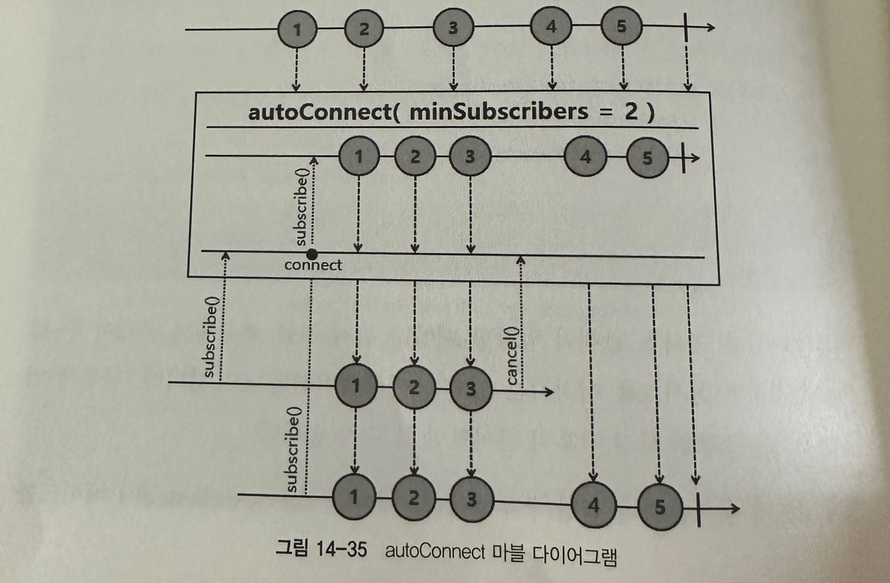

- publish 오퍼레이터의 경우 구독이 발생하더라도 connect 를 직접 호출하기 전까지는 데이터를 emit 하지 않아 직접 connect 를 호출해야함
- 반면 autoConnect 는 파라미터로 지정하는 숫자만큼의 구독이 발생하는 시점에 upstream 소스에 자동으로 연결되어 별도 호출 필요 없음

Example 14.62
~~~java
/**
 * multicast 예제
 *  - autoConnect() Operator
 *      - 다수의 Subscriber와 Flux를 공유한다.
 *      - 즉, Cold Sequence를 Hot Sequence로 변환한다.
 *      - 파라미터로 입력한 숫자만큼의 구독이 발생하는 시점에 connect()가 자동으로 호출된다.
 */
@Slf4j
public class Example14_62 {
    public static void main(String[] args) throws InterruptedException {
        Flux<String> publisher =
                Flux
                    .just("Concert part1", "Concert part2", "Concert part3")
                    .delayElements(Duration.ofMillis(300L))
                    .publish()
                    .autoConnect(2);

        Thread.sleep(500L);
        publisher.subscribe(data -> log.info("# audience 1 is watching {}", data));

        Thread.sleep(500L);
        publisher.subscribe(data -> log.info("# audience 2 is watching {}", data));

        Thread.sleep(500L);
        publisher.subscribe(data -> log.info("# audience 3 is watching {}", data));

        Thread.sleep(1000L);
    }
}
~~~

#### refCount
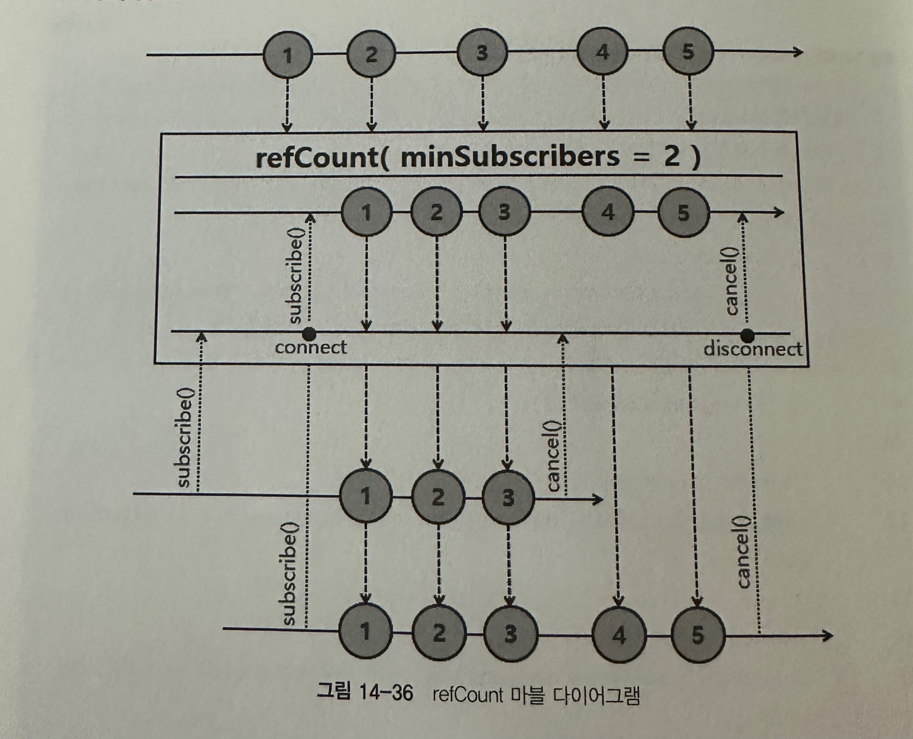

- refCount Operator 은 파라미터로 입력된 숫자만큼의 구독이 발생하는 시점에 Upstream 에 연결됨
- 모든 구독이 취소되거나 upstream 의 데이터 방출이 종료되면 연결 해제 
- 주로 무한 스트림 상황에서 모든 구독이 취소될 경우 연결 해제하는데 사용가능

Example 14.63
~~~java
/**
 * multicast 예제
 *  - refCount() Operator
 *      - 다수의 Subscriber와 Flux를 공유한다.
 *      - 즉, Cold Sequence를 Hot Sequence로 변환한다.
 *      - 파라미터로 입력한 숫자만큼의 구독이 발생하는 시점에 connect()가 자동으로 호출된다.
 *      - 모든 구독이 취소되면 Upstream 소스와의 연결을 해제한다.
 */
@Slf4j
public class Example14_63 {
    public static void main(String[] args) throws InterruptedException {
        Flux<Long> publisher =
                Flux
                    .interval(Duration.ofMillis(500))

                    .publish().autoConnect(1);
//                    .publish().refCount(1);
        Disposable disposable =
                publisher.subscribe(data -> log.info("# subscriber 1: {}", data));

        Thread.sleep(2100L);
        disposable.dispose();

        publisher.subscribe(data -> log.info("# subscriber 2: {}", data));

        Thread.sleep(2500L);
    }
}
~~~