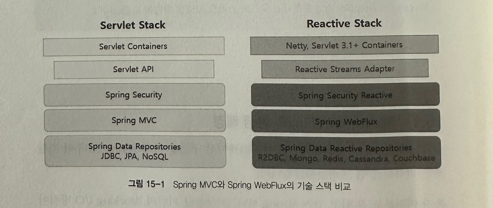
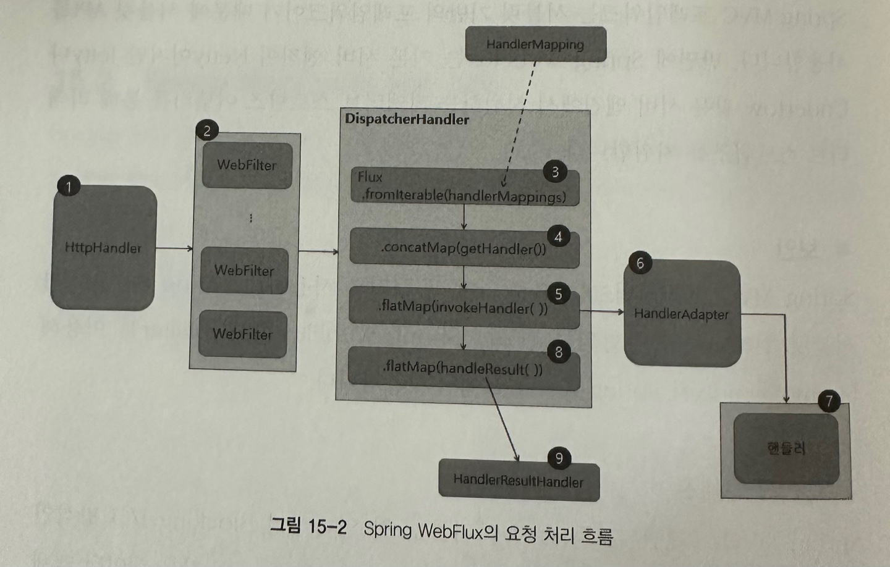
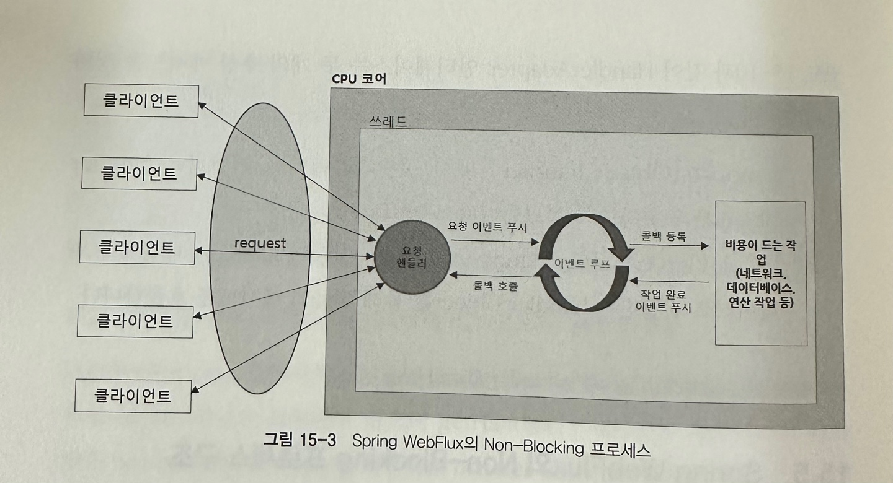

## 15. Spring WebFlux 개요

### 15.1 Spring WebFlux 의 탄생 배경
Spring WebFlux 는 스프링 5.0 부터 지원하는 리액티브 웹 프레임워크 입니다.
Spring MVC 에서 처리하지 못하는 많은 요청량을 처리하기 위해 만들어진 비동기 논블로킹 방식의 프레임워크 입니다.

### 15.2 Spring WebFlux의 기술 스택

#### 서버
- Spring MVC : 서블릿 컨테이너 블로킹 방식 (Tomcat ..)
- WebFlux : Netty 등의 서버 엔진에서 논블로킹 방식으로 동작

#### 서버 API
- Spring MVC : Servlet API 사용 
- WebFlux : 서버엔진에서 지원하는 리액티브 스트림즈 어댑터를 통해 리액티브 스트림즈 지원 

#### 보안 
- Spring MVC : Spring Security + 서블릿 컨테이너
- WebFlux : Spring Security Reactive

#### 데이터 액세스
- Spring MVC : 블로킹 방식의 Spring Data XXXX 
- WebFlux : Spring Data R2DBC / 논블로킹 지원 NoSql 모듈 

### 15.3 Spring WebFlux의 요청 처리 흐름

1. 요청이 들어오면 서버 엔진을 거쳐 HttpHandler 가 들어오는 요청 전달받음 
- HttpHandler 는 각 서버 엔진마다 주어지는 ServerWebExchange(ServerHttpResponse,ServerHttpResponse 포함) 를 생성하고 WebFilter 체인으로 전송

2. ServerWebExchange 는 WebFilter 체인에서 전처리 과정을 거친 후 WebHandler 인터페이스의 구현체인 DispatcherServlet 에게 전달됨 

3. DispatcherHandler 에서 HandlerMapping List 를 원본 Flux 의 소스로 전달받음 

4. ServerWebExchange 를 처리할 핸들러 조회 

5. 조회한 핸들러의 호출을 HandlerAdapter 에게 위임

6. HandlerAdapter 은 ServerWebExchange 를 차리할 핸들러를 호출

7. Controller / HandlerFunction 형태의 핸들러에서 요청을 처리한 후, 응답 데이터 리턴

8. 핸들러로부터 리턴받은 응답 데이터를 처리할 HandlerResultHandler 조회 

9. 조회한 HandlerResultHandler 가 응답 데이터를 적절히 처리 후 response 로 응답

### 15.4 Spring WebFlux의 핵심 컴포넌트 

#### HttpHandler 

[코드 15.1]
~~~java
public interface HttpHandler {
    Mono<Void> handle(ServerHttpRequest request, ServerHttpResponse response);
}
~~~

- handle 메서드 
[코드 15.2]
~~~java
public class HttpWebHandlerAdapter extends WebHandlerDecorator implements HttpHandler {

    ...

    @Override
    public Mono<Void> handle(ServerHttpRequest request, ServerHttpResponse response) {

        ...
        ServerWebExchange exchange = createExchange(request, response);
    }
}
~~~

- HttpWebHandlerAdapter 클래스는 handle() 메서드의 파라미터로 전달받은 ServerHttpRequest 와 ServerHttpResponse 로 ServerWebExchange 를 생성한 후에 WebHandler 을 호출하는 역할을 함 

#### WebFilter 
WebFilter 은 Spring MVC 서블릿 필터처럼 핸들러가 요청을 처리하기 전에 전처리 작업을 할 수 있도록 함 

[코드 15.3]
~~~java
public interface WebFilter {
    Mono<Void> filter(ServerWebExchange exchange, WebFilterChain chain);
}
~~~

- 체이닝 가능 

[코드 15.4]
~~~java
@Component
public class BookLogFilter implements WebFilter {
    @Override
    public Mono<Void> filter(ServerWebExchange exchange, WebFilterChain chain) {
        String path = exchange.getRequest().getURI().getPath();
        return chain.filter(exchange).doAfterTerminate(() -> {
            if (path.contains("books")) {
                System.out.println("path: " + path + ", status: " +
                        exchange.getResponse().getStatusCode());
            }
        });
    }
}
~~~

* Spring Webflux 는 클라이언트의 요청부터 응답까지 리액터의 두가지 타입인 Flux, Mono 의 Operator 체인으로 구성된 하나의 길다란 시퀀스라고 보면 쉬움 

#### HandlerFilterFunction
함수형 기반의 요청 핸들러에 적용할 수 있는 Filter

[코드 15.5]
~~~java
public interface HandlerFilterFunction<T, R> {
    Mono<R> filter(ServerRequest request, HandlerFunction<T, R> next);
}
~~~

[코드 15.6]
~~~java
public class BookRouterFunctionFilter implements HandlerFilterFunction {
    @Override
    public Mono<ServerResponse> filter(ServerRequest request, HandlerFunction next) {
        String path = request.requestPath().value();

        return next.handle(request).doAfterTerminate(() -> {
            System.out.println("path: " + path + ", status: " +
                    request.exchange().getResponse().getStatusCode());
        });
    }
}
~~~

- BookRouterFuntionFilter 울 구현 
- Book 리소스에 대한 요청만 로깅하도록 함
- HandlerFilterFunction 구현체는 애너테이션 기반이 아니라 함수형 기반의 요청 핸들러에서 처리하기 때문에 Spring Bean 으로 등록되지 않음

[코드 15.7]
~~~java
@Configuration
public class BookRouterFunction {
    @Bean
    public RouterFunction routerFunction() {
        return RouterFunctions
                .route(GET("/v1/router/books/{book-id}"),
                        (ServerRequest request) -> this.getBook(request))
                .filter(new BookRouterFunctionFilter());
    }

    public Mono<ServerResponse> getBook(ServerRequest request) {
        return ServerResponse
                .ok()
                .body(Mono.just(BookDto.Response.builder()
                        .bookId(Long.parseLong(request.pathVariable("book-id")))
                        .bookName("Advanced Reactor")
                        .author("Tom")
                        .isbn("222-22-2222-222-2").build()), BookDto.Response.class);
    }
}
~~~

- BookRouterFuntionFilter 함수형 기반의 요청 핸들러에 적용하는 예

#### DispatcherHandler 

- WebHandler 인터페이스의 구현체 (Dispatcher Servlet 과 유사)
- DispatcherHandler 는 스프링 빈으로 등록
- 요청 처리를 위한 위임 컴포넌트를 검색 

[코드 15.8]
~~~java
public class DispatcherHandler implements HttpHandler {

    private final HandlerMapping handlerMapping;
    private final HandlerAdapter handlerAdapter;

    public DispatcherHandler(HandlerMapping handlerMapping, HandlerAdapter handlerAdapter) {
        this.handlerMapping = handlerMapping;
        this.handlerAdapter = handlerAdapter;
    }

    @Override
    public Mono<Void> handle(ServerHttpRequest request, ServerHttpResponse response) {
        ServerWebExchange exchange = createServerWebExchange(request, response);
        return invokeHandler(exchange);
    }

    private ServerWebExchange createServerWebExchange(ServerHttpRequest request, ServerHttpResponse response) {
        // Create a ServerWebExchange object based on the request and response
        return new DefaultServerWebExchange(request, response, handlerAdapter.getMessageReaders());
    }

    private Mono<Void> invokeHandler(ServerWebExchange exchange) {
        // Find the appropriate handler for the given request
        Mono<HandlerExecutionChain> chainMono = handlerMapping.getHandler(exchange);

        // Handle the request using the handler
        return chainMono.flatMap(chain -> {
            try {
                return handlerAdapter.handle(exchange, chain.getHandler());
            } catch (Exception e) {
                return Mono.error(e);
            }
        }).flatMap(result -> handleResult(result, exchange));
    }

    private Mono<Void> handleResult(HandlerResult result, ServerWebExchange exchange) {
        // Handle the result of the handler execution
        return handlerAdapter.handleResult(exchange, result);
    }
}
~~~

- DispatcherHandler 코드의 일부

#### 1. `initStrategies(ApplicationContext context)`
BeanFactoryUtils 를 이용하여 ApplicationContext 로 부터 아래 Bean 들 검색 

HandlerMapping Bean => `List<HandlerMapping>`  
HandlerAdapter Bean => `List<HandlerAdapter>`  
HandlerRequestHandler Bean => `List<HandlerRequestHandler>`  

#### 2. `handle(ServerWebExchange exchange)`
1. `List<HandlerMapping>` 을 원본 데이터 소스로 입력받은 후 `getHandler` 메서드를 통해 매치되는 핸들러 중 첫 핸들러 사용

2. `invokeHandler` 을 통해 핸들러 호출 위임 
- 실제 핸들러 호출은 `invokeHandler()` 내부에서 Handle 객체와 매핑되는 `HandlerAdapter` 을 통해서 이루어짐

3. `handleResult` 를 통해 응답 처리를 위임 
- 실제 응답처리는 `handlerResult()` 내부에서 호출한 `getResultHandler()` 에서 `HandlerResult` 객체와 매핑되는 `HandlerResultHandler` 을 통해서 이루어짐

### 15.5 Spring WebFlux 의 Non-Blocking 프로세스 구조 

- 블로킹 방식은 스레드 풀로 여러개의 스레드를 관리하며 한 스레드가 한 요청을 처리함 (한 스레드가 차단)

- 논블로킹은 스레드가 차단되지 않아 적은 수의 스레드 풀로도 더 많은 요청 처리 가능 (이벤트 루프 방식)

1. 클라이언트로 부터 들어오는 요청을 요청 핸들러가 전달받음 
2. 전달받은 요청을 이벤트 루프에 푸시
3. 이벤트 루프는 네트워크, DB 연결 등 비용 드는 작업에 대한 콜백 등록
4. 작업이 완료되면 완료 이벤트를 이벤트 루프에 푸시
5. 등록한 콜백을 호출해 처리결과 전달 

모든 작업들이 이벤트로 처리되기에 이벤트 발생 시 해당 이벤트에 대한 콜백 등록하며 다음 이벤트 처리로 넘어감 

### 15.6 Spring WebFlux 의 스레드 모델 
- Netty 등 논불로킹 서버 엔진은 적은수 스레드 고정(CPU 코어 개수)
- 보통 비동기 처리 시퀀스에서는 고부하 작업을 적은 스레드로 처리할 수 있지만, 해당 과정 안에 블로킹되는 지점이 존재한다면 성능이 오히려 저하될 수 있음 